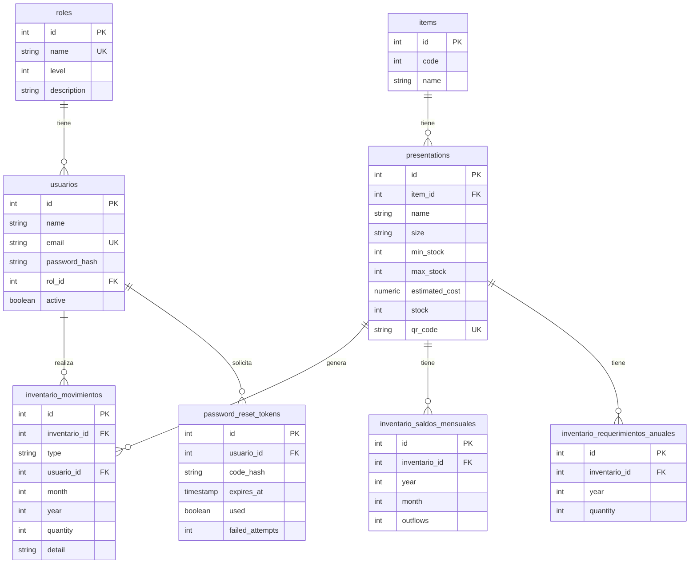
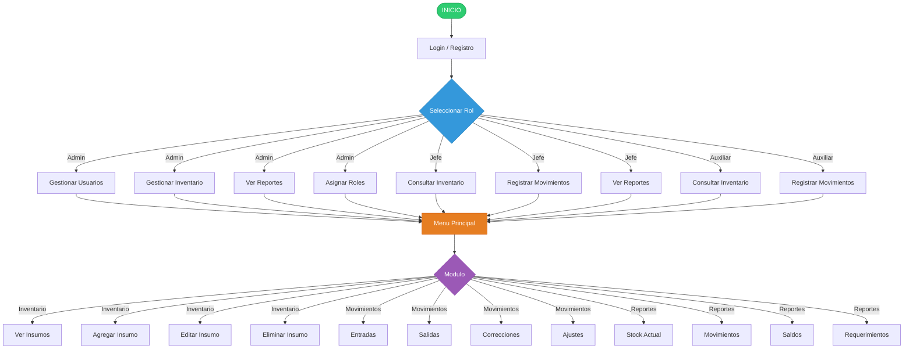
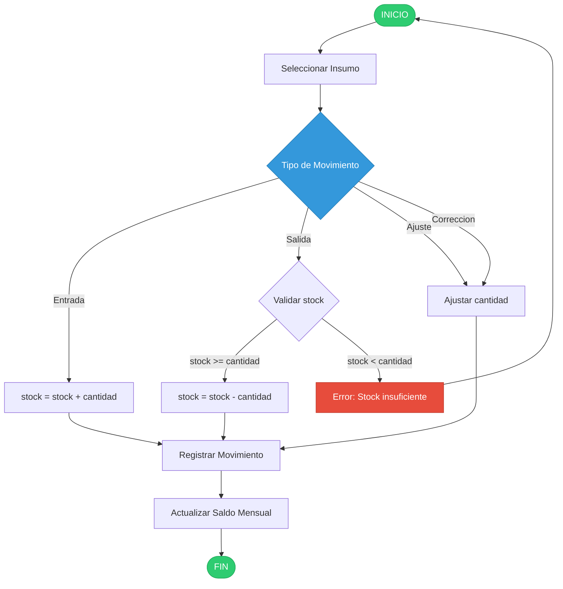
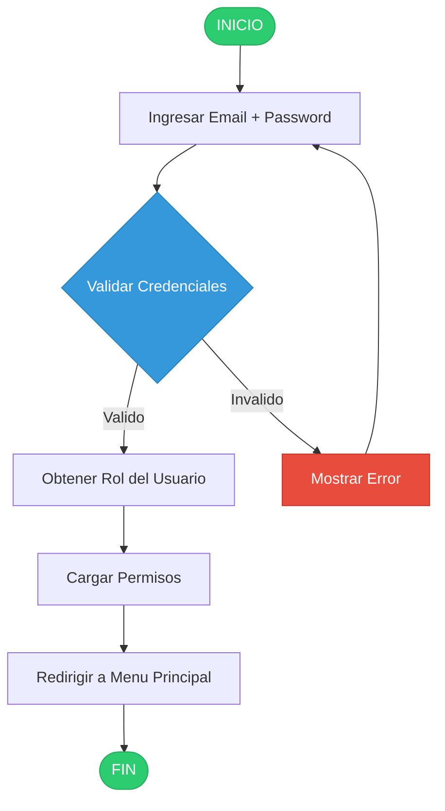

# Sistema de Gestion de Inventario de Insumos

Sistema web para el control y gestion de inventario de insumos, con soporte para multiples usuarios y roles (Administrador, Jefe, Auxiliar). Permite registrar entradas, salidas, ajustes y correcciones con validaciones estrictas de stock.

---

## Stack Tecnologico

| Capa | Tecnologia | Version |
|------|------------|---------|
| Backend | Spring Boot | 4.1.0 |
| Persistencia | Spring Data JPA / Hibernate | 7.4.1 |
| Base de Datos | PostgreSQL | 16 |
| Seguridad | Spring Security + JWT | - |
| Build | Gradle | 8.7 |
| Contenedor | Docker / Docker Compose | - |
| Lenguaje | Java | 17 |

---

## Estructura del Proyecto

```
migracion-springboot-react/
├── backend/                  # API REST - Spring Boot
│   ├── src/main/java/
│   │   └── com/gestion/inventario/
│   │       ├── BackendApplication.java
│   │       ├── config/
│   │       ├── controller/
│   │       ├── dto/
│   │       ├── exception/
│   │       ├── model/
│   │       ├── repository/
│   │       ├── security/
│   │       └── service/
│   ├── src/main/resources/
│   │   ├── application.properties
│   │   ├── application-prod.properties
│   │   └── db/migration/        # Migraciones Flyway (PostgreSQL)
│   ├── build.gradle
│   └── Dockerfile
├── database/
│   ├── postgres/                # Esquema PostgreSQL y guías de conexión
│   ├── ER.md                    # Diagrama Entidad-Relacion
│   ├── flujo-sistema.md         # Diagramas de flujo
│   └── casos-uso.md             # Casos de uso y matriz de permisos
├── docs/
│   ├── BITACORA_PROBLEMAS.md
│   ├── COMO_LEVANTAR_LOS_SERVICIOS.md
│   └── FASES_DESARROLLO.md
├── frontend/                    # React + Vite (+ Dockerfile/nginx.conf)
├── docker-compose.yml           # Alias de docker-compose.prod.yml
└── docker-compose.prod.yml      # Produccion (db + backend + frontend)
```

---

## Diagrama Entidad-Relacion



---

## Diagrama de Flujo del Sistema



---

## Flujo de Movimientos



---

## Flujo de Autenticacion



---

## Ejecucion con Docker

> Ejecuta los comandos desde la **raiz del proyecto** (`migracion-springboot-react/`,
> donde estan los `docker-compose*.yml`), no desde `backend/` ni `frontend/`.
>
> Requiere archivo `.env` (crea uno a partir de `.env.example`):
> `cp .env.example .env`

```bash
# Construir y ejecutar los 3 servicios (db + backend + frontend)
docker compose up --build -d

# Ver logs
docker compose logs -f backend

# Detener
docker compose down
```

- **App completa:** `http://localhost` (Nginx sirve el build de React y proxya `/api` al backend)
- **API directa:** `http://localhost:8080`

> El `docker-compose.yml` por defecto es un alias de `docker-compose.prod.yml`;
> ambos son identicos y levantan PostgreSQL + frontend (no SQLite).

---

## Roles y Permisos

Matriz de acceso por módulo/URL (fuente: `frontend/src/access.ts`) reforzada en el
backend con `@PreAuthorize`.

| Modulo | Admin | Jefe | Auxiliar |
|--------|:-----:|:----:|:--------:|
| Dashboard | Si | Si | Si |
| Catálogo de Insumos | Si | Si | No |
| Movimientos (Kárdex) | Si | Si | Si |
| Auditoría / Ajustes | Si | Si | No |
| Reportes | Si | Si | Si |
| Proyecciones (Smart Restock) | Si | Si | No |
| Gestión de Usuarios | Si | No | No |

Operaciones que requieren **solo ADMIN** (backend `@PreAuthorize`): crear/editar
materiales y presentaciones (`POST/PUT /items`, `PUT /presentations`), y todo el
CRUD de usuarios. Movimientos y reportes están disponibles para los tres roles.

> Nota: en la versión distribuida (Spring Boot + React), los módulos de
> "Eliminar insumo" y "Requerimientos/Saldos" anuales pasaron a un esquema
> normalizado de **items -> presentations**; el catálogo es gestionado por
> ADMIN/JEFE y los ajustes quedan restringidos a ADMIN/JEFE.
