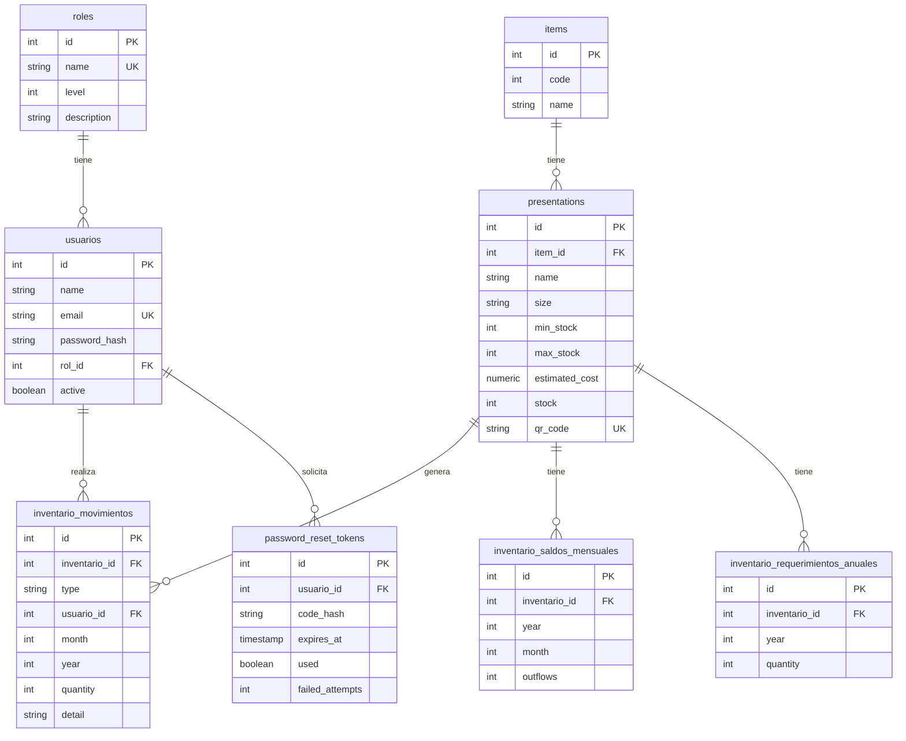
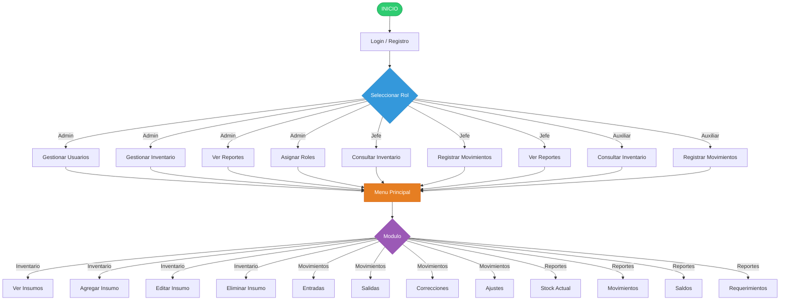
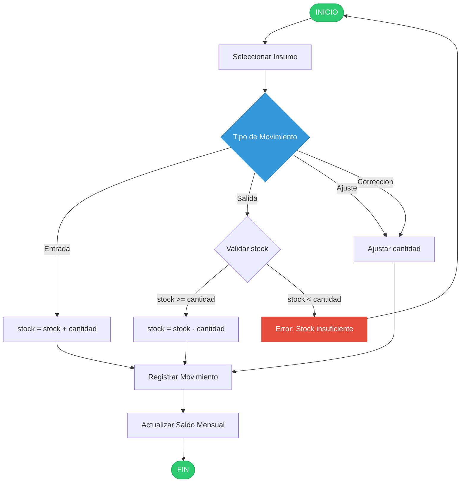
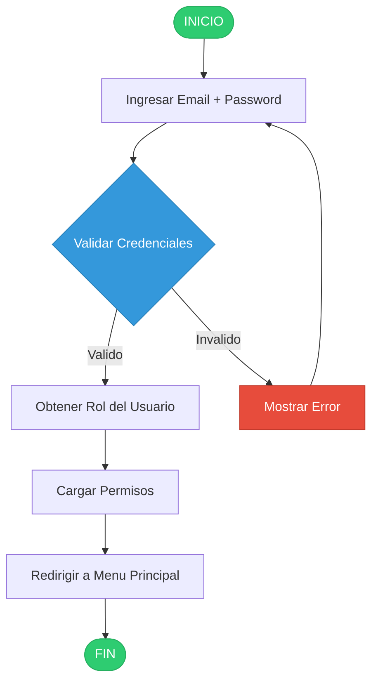

# Sistema de Gestion de Inventario de Insumos

Sistema web para el control y gestion de inventario de insumos, con soporte para multiples usuarios y roles (Administrador, Jefe, Auxiliar). Permite registrar entradas, salidas, ajustes y correcciones con validaciones estrictas de stock.

---

## Stack Tecnologico

| Capa | Tecnologia | Version |
|------|------------|---------|
| Backend | Spring Boot | 4.1.x (Java 21) |
| Persistencia | Spring Data JPA / Hibernate | 7.4.1 |
| Base de Datos | PostgreSQL | 16 |
| Seguridad | Spring Security + JWT (HS512) + BCrypt | - |
| Build | Gradle | imagen Docker `gradle:9.5.1-jdk21` |
| Contenedor | Docker / Docker Compose | - |
| Frontend | React 19 + Vite 8 + Tailwind CSS 4 | - |
| Tiempo real | WebSocket (`/ws/auditoria`) | - |
| Pruebas | Vitest + Testing Library (front) / JUnit 5 + Mockito (back) | - |
| Validacion E2E | Python 3 (solo stdlib) | `scripts/smoke_test_e2e.py` |

> **¿Por que Git reporta Python?** El unico archivo Python del repositorio es
> `scripts/smoke_test_e2e.py`: un smoke test que recorre los flujos completos de la API
> (login, usuarios, insumos, motor transaccional, control de acceso y reportes) y reporta
> PASS/FAIL. Se eligio Python a proposito porque **no requiere instalar dependencias**
> (usa solo `urllib` de la libreria estandar), asi que corre en cualquier servidor con
> `python3` instalado. **No es parte del sistema en produccion**: el backend es Java y el
> frontend es TypeScript/React. Se invoca manualmente o desde la skill
> `.opencode/skills/validacion-e2e`, nunca por la aplicacion.

---

## Estructura del Proyecto

```
gestion-inventario-sprinReact/
├── backend/                  # API REST - Spring Boot
│   ├── src/main/java/
│   │   └── com/gestion/inventario/
│   │       ├── BackendApplication.java
│   │       ├── config/
│   │       ├── controller/
│   │       ├── dto/
│   │       ├── exception/
│   │       ├── model/
│   │       ├── repository/
│   │       ├── security/
│   │       └── service/
│   ├── src/main/resources/
│   │   ├── application.properties
│   │   ├── application-prod.properties
│   │   └── db/migration/        # Migraciones Flyway (PostgreSQL)
│   ├── build.gradle
│   └── Dockerfile
├── database/
│   ├── postgres/                # Esquema PostgreSQL y guías de conexión
│   ├── ER.md                    # Diagrama Entidad-Relacion
│   ├── flujo-sistema.md         # Diagramas de flujo
│   └── casos-uso.md             # Casos de uso y matriz de permisos
├── docs/
│   ├── BITACORA_PROBLEMAS.md
│   ├── COMO_LEVANTAR_LOS_SERVICIOS.md
│   ├── FASES_DESARROLLO.md
│   ├── MEJORAS_IMPLEMENTACIONES.md
│   └── upgrade-V2-Manejo-de-bodegas.md
├── frontend/                    # React + Vite (+ Dockerfile/nginx.conf)
├── scripts/                     # Utilidades de operacion y validacion
│   ├── smoke_test_e2e.py        # Smoke test E2E de la API (Python, solo stdlib)
│   ├── limpiar_e2e.sql          # Limpieza de los datos que crea el smoke test
│   └── test_backend.sh          # Tests JUnit/Mockito en Docker
├── deploy.sh                    # Despliegue a los ambientes del servidor
├── deploy-local.sh              # Despliegue en el servidor de desarrollo
├── docker-compose.yml           # Alias de docker-compose.prod.yml
└── docker-compose.prod.yml      # Produccion (db + backend + frontend)
```

### Estructura del frontend (`frontend/src/`)

```
src/
├── main.tsx                     # Punto de entrada (monta React + Router)
├── App.tsx                      # Rutas y protecciones de la aplicacion
├── access.ts                    # Matriz de acceso por ruta y rol (MODULE_ACCESS)
│
├── api/
│   └── axios.ts                 # Cliente HTTP: baseURL, interceptor JWT, refresh de sesion
│
├── store/                       # Estado global (Zustand)
│   ├── useAuthStore.ts          # Sesion, usuario, rol, token (persistido)
│   └── useToastStore.ts         # Notificaciones/toasts
│
├── hooks/                       # Lógica reutilizable
│   ├── useAuditSocket.ts        # Conexion WebSocket a /ws/auditoria
│   └── useRealtimeSync.ts       # Re-consulta REST al recibir eventos de un tipo
│
├── pages/                       # Una pantalla por ruta
│   ├── Login.tsx                # Inicio de sesion
│   ├── RecuperarPassword.tsx    # Solicitud y cambio de contraseña (por codigo)
│   ├── Dashboard.tsx            # KPIs, stock bajo y ultimos movimientos
│   ├── Insumos.tsx              # Catalogo (items -> presentations) + QR
│   ├── Movimientos.tsx          # Kárdex: entradas, salidas y filtros
│   ├── Ajustes.tsx              # Ajustes de inventario con justificacion
│   ├── Proyecciones.tsx         # Smart Restock (stock minimo sugerido)
│   ├── Reportes.tsx             # Reportes con exportacion Excel/PDF
│   ├── Auditoria.tsx            # Bitacora de auditoria (solo ADMIN)
│   └── Usuarios.tsx             # Gestion de usuarios y roles (solo ADMIN)
│
├── components/                  # Componentes de UI reutilizables
│   ├── Layout.tsx               # Sidebar, header, perfil y menu por rol
│   ├── ProtectedRoute.tsx       # Ruta que exige sesion
│   ├── RequireRole.tsx          # Ruta que exige un rol concreto
│   ├── InsumoModal.tsx          # Alta/edicion de material + presentaciones
│   ├── UsuarioModal.tsx         # Alta/edicion de usuario y rol
│   ├── MovimientoModal.tsx      # Entrada / salida de stock
│   ├── AjusteModal.tsx          # Ajuste con justificacion (>= 20 chars)
│   ├── ProfileModal.tsx         # Cambio de contraseña del usuario
│   ├── InsumoCombobox.tsx       # Busqueda/autocompletado de insumos
│   ├── SearchModal.tsx          # Busqueda global
│   ├── QrScanner.tsx            # Camara + escaneo de codigos QR
│   ├── QrModal.tsx              # Resultado del escaneo + accion rapida
│   ├── ConfirmModal.tsx         # Confirmacion de acciones destructivas
│   ├── SuccessModal.tsx         # Confirmacion de exito
│   └── Toast.tsx                # Notificaciones no bloqueantes
│
├── utils/
│   ├── sound.ts                 # Sonido de confirmacion del escaneo QR
│   └── stockStatus.ts           # Reglas de estado de stock (bajo/optimo/alto)
│
└── test/
    └── setup.ts                 # Configuracion de Vitest + Testing Library
```

Convenciones:
- Los tests viajan **junto al componente** que prueban (`*.test.tsx`).
- Componentes de solo icono llevan `title` (tooltip), y el texto explicativo
  vive en tooltips, no dentro de los modales (ver `AGENTS.md` seccion 5).

---

## Diagrama Entidad-Relacion


```mermaid
erDiagram
    roles {
        int id PK
        string name UK
        int level
        string description
    }

    usuarios {
        int id PK
        string name
        string email UK
        string password_hash
        int rol_id FK
        boolean active
    }

    items {
        int id PK
        int code
        string name
    }

    presentations {
        int id PK
        int item_id FK
        string name
        string size
        int min_stock
        int max_stock
        numeric estimated_cost
        int stock
        string qr_code UK
    }

    inventario_movimientos {
        int id PK
        int inventario_id FK
        string type
        int usuario_id FK
        int month
        int year
        int quantity
        string detail
    }

    inventario_saldos_mensuales {
        int id PK
        int inventario_id FK
        int year
        int month
        int outflows
    }

    inventario_requerimientos_anuales {
        int id PK
        int inventario_id FK
        int year
        int quantity
    }

    password_reset_tokens {
        int id PK
        int usuario_id FK
        string code_hash
        timestamp expires_at
        boolean used
        int failed_attempts
    }

    roles ||--o{ usuarios : "tiene"
    items ||--o{ presentations : "tiene"
    presentations ||--o{ inventario_movimientos : "genera"
    usuarios ||--o{ inventario_movimientos : "realiza"
    presentations ||--o{ inventario_saldos_mensuales : "tiene"
    presentations ||--o{ inventario_requerimientos_anuales : "tiene"
    usuarios ||--o{ password_reset_tokens : "solicita"
```

> **Nota sobre nombres de columnas:** `inventario_movimientos.inventario_id` conserva su
> nombre historico, pero desde la migracion **V3** apunta a `presentations.id` (la
> entidad Java lo llama `presentation`). Las tablas `inventario_saldos_mensuales` e
> `inventario_requerimientos_anuales` si siguen apuntando a la tabla legado
> `inventario_insumos`.

---

## Diagrama de Flujo del Sistema


```mermaid
flowchart TD
    A([INICIO]) --> B[Login / Registro]
    B --> C{Seleccionar Rol}

    C -->|Admin| D[Gestionar Usuarios]
    C -->|Admin| E[Gestionar Inventario]
    C -->|Admin| F[Ver Reportes]
    C -->|Admin| G[Asignar Roles]

    C -->|Jefe| H[Consultar Inventario]
    C -->|Jefe| I[Registrar Movimientos]
    C -->|Jefe| J[Ver Reportes]

    C -->|Auxiliar| K[Consultar Inventario]
    C -->|Auxiliar| L[Registrar Movimientos]

    D --> M[Menu Principal]
    E --> M
    F --> M
    G --> M
    H --> M
    I --> M
    J --> M
    K --> M
    L --> M

    M --> N{Modulo}

    N -->|Inventario| O[Ver Insumos]
    N -->|Inventario| P[Agregar Insumo]
    N -->|Inventario| Q[Editar Insumo]
    N -->|Inventario| R[Eliminar Insumo]

    N -->|Movimientos| S[Entradas]
    N -->|Movimientos| T[Salidas]
    N -->|Movimientos| U[Correcciones]
    N -->|Movimientos| V[Ajustes]

    N -->|Reportes| W[Stock Actual]
    N -->|Reportes| X[Movimientos]
    N -->|Reportes| Y[Saldos]
    N -->|Reportes| Z[Requerimientos]

    style A fill:#2ecc71,stroke:#27ae60,color:#fff
    style C fill:#3498db,stroke:#2980b9,color:#fff
    style M fill:#e67e22,stroke:#d35400,color:#fff
    style N fill:#9b59b6,stroke:#8e44ad,color:#fff
```

---

## Flujo de Movimientos


```mermaid
flowchart TD
    A([INICIO]) --> B[Seleccionar Insumo]
    B --> C{Tipo de Movimiento}

    C -->|Entrada| D[stock = stock + cantidad]
    C -->|Salida| E{Validar stock}
    C -->|Ajuste| F[Ajustar cantidad]
    C -->|Correccion| F

    E -->|stock >= cantidad| G[stock = stock - cantidad]
    E -->|stock < cantidad| H[Error: Stock insuficiente]

    D --> I[Registrar Movimiento]
    G --> I
    F --> I
    H --> A

    I --> J[Actualizar Saldo Mensual]
    J --> K([FIN])

    style A fill:#2ecc71,stroke:#27ae60,color:#fff
    style C fill:#3498db,stroke:#2980b9,color:#fff
    style H fill:#e74c3c,stroke:#c0392b,color:#fff
    style K fill:#2ecc71,stroke:#27ae60,color:#fff
```

---

## Flujo de Autenticacion


```mermaid
flowchart TD
    A([INICIO]) --> B[Ingresar Email + Password]
    B --> C{Validar Credenciales}

    C -->|Valido| D[Obtener Rol del Usuario]
    C -->|Invalido| E[Mostrar Error]

    E --> B

    D --> F[Cargar Permisos]
    F --> G[Redirigir a Menu Principal]
    G --> H([FIN])

    style A fill:#2ecc71,stroke:#27ae60,color:#fff
    style C fill:#3498db,stroke:#2980b9,color:#fff
    style E fill:#e74c3c,stroke:#c0392b,color:#fff
    style H fill:#2ecc71,stroke:#27ae60,color:#fff
```

---

## Ejecucion con Docker

> Ejecuta los comandos desde la **raiz del proyecto** (`migracion-springboot-react/`,
> donde estan los `docker-compose*.yml`), no desde `backend/` ni `frontend/`.
>
> Requiere archivo `.env` (crea uno a partir de `.env.example`):
> `cp .env.example .env`

```bash
# Construir y ejecutar los 3 servicios (db + backend + frontend)
docker compose up --build -d

# Ver logs
docker compose logs -f backend

# Detener
docker compose down
```

- **App completa:** `http://localhost` (Nginx sirve el build de React y proxya `/api` al backend)
- **API directa:** `http://localhost:8080`

> El `docker-compose.yml` por defecto es un alias de `docker-compose.prod.yml`;
> ambos son identicos y levantan PostgreSQL + frontend (no SQLite).

---

## Roles y Permisos

Matriz de acceso por módulo/URL (fuente: `frontend/src/access.ts`) reforzada en el
backend con `@PreAuthorize`.

| Módulo | Admin | Jefe | Auxiliar |
|--------|:-----:|:----:|:--------:|
| Dashboard | Si | Si | Si |
| Catálogo de Insumos | Si | Si | No |
| Movimientos (Kárdex) | Si | Si | Si |
| Ajustes / Auditoría | Si | Si | No |
| Reportes | Si | Si | Si |
| Proyecciones (Smart Restock) | Si | Si | No |
| Gestión de Usuarios | Si | No | No |
| Bitácora de Auditoría | Si | No | No |

Operaciones que requieren **solo ADMIN** (backend `@PreAuthorize`): crear/editar
materiales y agregar presentaciones (`POST/PUT /items`, `POST /items/{id}/presentations`),
y todo el CRUD de usuarios (`/usuarios/admin`). Activar/inactivar insumos
(`PUT /items/{id}/estado`) admite ADMIN y JEFE. Movimientos, ajustes y reportes están
disponibles según la matriz anterior.

> Nota: en la versión distribuida (Spring Boot + React), los módulos de
> "Eliminar insumo" y "Requerimientos/Saldos" anuales pasaron a un esquema
> normalizado de **items -> presentations**; el catálogo es gestionado por
> ADMIN/JEFE y los ajustes quedan restringidos a ADMIN/JEFE.

---

## Documentación

| Documento | Contenido |
|---|---|
| `DOCUMENTACION_SISTEMA.md` | Contexto técnico completo (arquitectura, API, modelo de datos, reglas de negocio). |
| `CONTEXTO_AGENTE_DOCUMENTACION.md` | Contexto verificado para el agente que redacta la documentación y el manual de usuario. |
| `AGENTS.md` | Convenciones del proyecto, reglas de negocio y estado de fases. |
| `FLUJO_DESPLIEGUE.md` | Flujo de ambientes y ramas (`desa` → `pre` → `pro`). |
| `DESPLIEGUE_LOCAL_UBUNTU.md` | Guía de despliegue en el servidor Ubuntu. |
| `docs/MEJORAS_IMPLEMENTACIONES.md` | Bitácora de mejoras con archivos afectados y comportamiento. |
| `docs/upgrade-V2-Manejo-de-bodegas.md` | Análisis de impacto y decisiones abiertas del upgrade a inventario por bodegas, incluido el **motor de préstamos entre bodegas** (Fase 10, no implementada). |
| `database/ER.md` | Diagrama entidad-relación y esquema PostgreSQL. |
