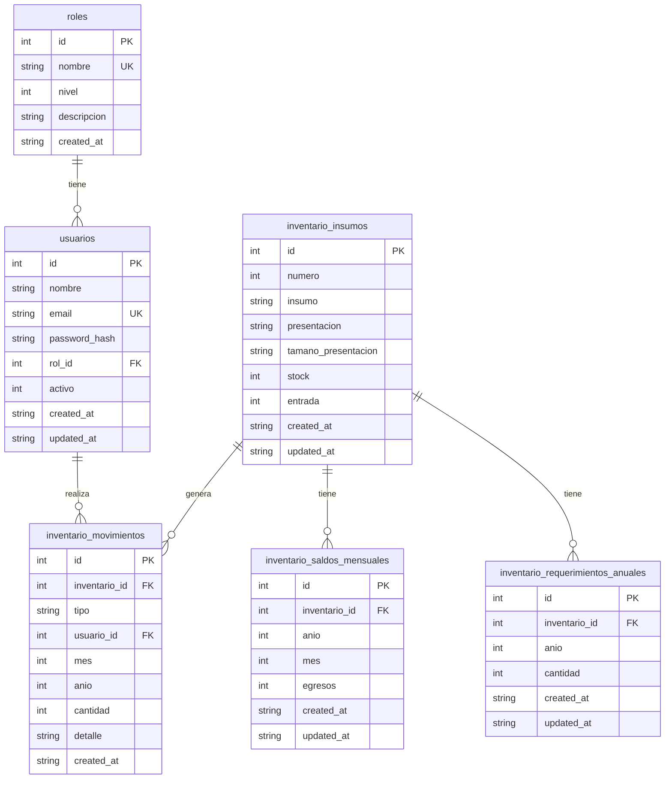

# Diagrama Entidad-Relación

## Modelo Relacional (Mermaid)

## Resumen de Relaciones

| Relacion | Tipo | FK | Restriccion |
|----------|------|-----|-------------|
| `roles` → `usuarios` | 1:N | `rol_id` | NOT NULL |
| `usuarios` → `movimientos` | 1:N | `usuario_id` | NOT NULL |
| `insumos` → `movimientos` | 1:N | `inventario_id` | ON DELETE CASCADE |
| `insumos` → `saldos_mensuales` | 1:N | `inventario_id` | ON DELETE CASCADE |
| `insumos` → `requerimientos_anuales` | 1:N | `inventario_id` | ON DELETE CASCADE |

## Llaves Primarias

| Tabla | PK | Tipo | Generacion |
|-------|-----|------|------------|
| `roles` | `id` | INT | AUTOINCREMENT |
| `usuarios` | `id` | INT | AUTOINCREMENT |
| `inventario_insumos` | `id` | INT | AUTOINCREMENT |
| `inventario_saldos_mensuales` | `id` | INT | AUTOINCREMENT |
| `inventario_requerimientos_anuales` | `id` | INT | AUTOINCREMENT |
| `inventario_movimientos` | `id` | INT | AUTOINCREMENT |

## Llaves Foraneas

| Tabla | Columna FK | Tabla Referenciada | Columna PK | Accion |
|-------|------------|-------------------|------------|--------|
| `usuarios` | `rol_id` | `roles` | `id` | - |
| `inventario_movimientos` | `inventario_id` | `inventario_insumos` | `id` | CASCADE |
| `inventario_movimientos` | `usuario_id` | `usuarios` | `id` | - |
| `inventario_saldos_mensuales` | `inventario_id` | `inventario_insumos` | `id` | CASCADE |
| `inventario_requerimientos_anuales` | `inventario_id` | `inventario_insumos` | `id` | CASCADE |

## Restricciones Unicas

| Tabla | Columnas | Nombre |
|-------|----------|--------|
| `roles` | `nombre` | UNIQUE |
| `usuarios` | `email` | UNIQUE |
| `inventario_insumos` | `insumo, presentacion, tamano_presentacion` | uq_insumo |
| `inventario_saldos_mensuales` | `inventario_id, anio, mes` | uq_saldo_mensual |
| `inventario_requerimientos_anuales` | `inventario_id, anio` | uq_requerimiento_anual |

## CHECK Constraints

| Tabla | Columna | Condicion |
|-------|---------|-----------|
| `inventario_saldos_mensuales` | `mes` | `BETWEEN 1 AND 12` |
| `inventario_movimientos` | `mes` | `IS NULL OR (BETWEEN 1 AND 12)` |
