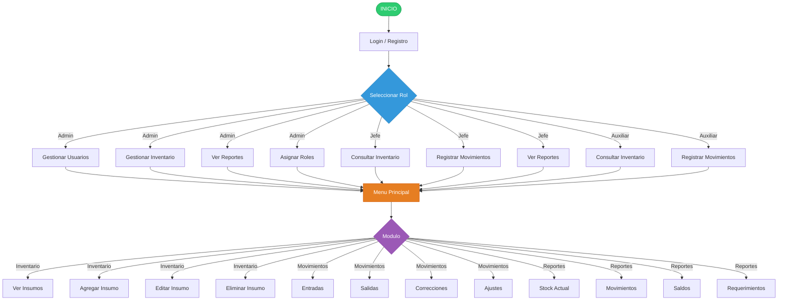
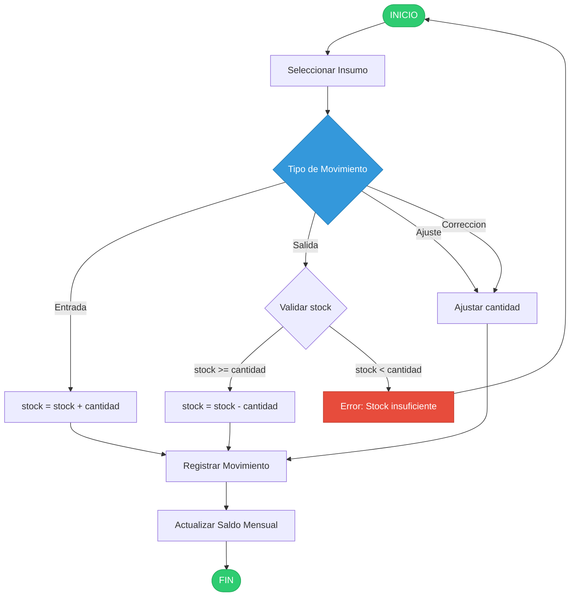
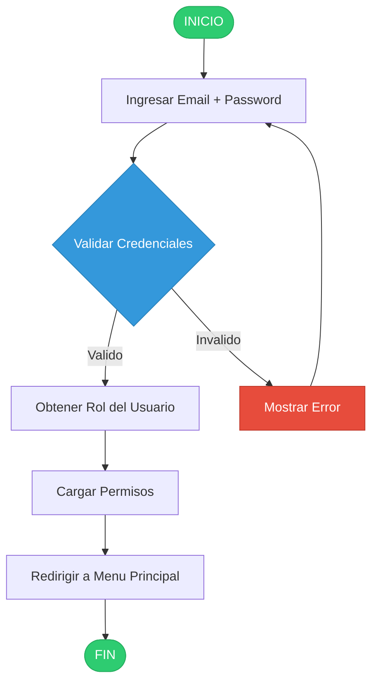
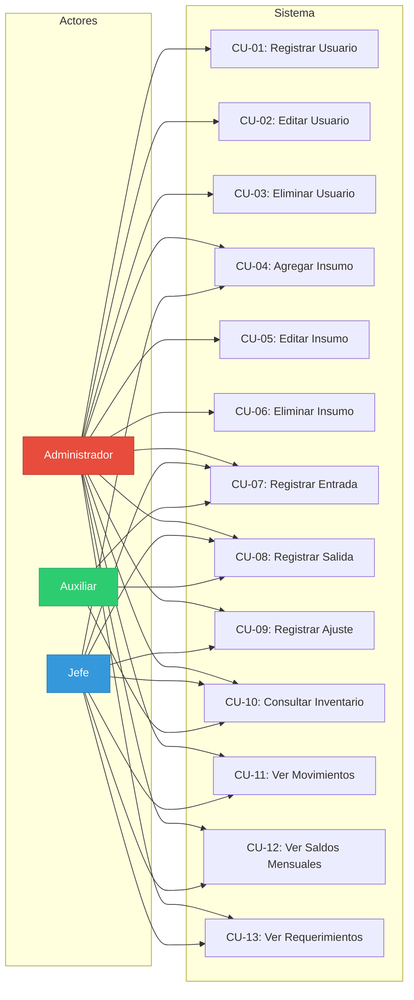

# Diagrama de Flujo del Sistema

## Flujo General del Sistema

```mermaid
flowchart TD
    A([INICIO]) --> B[Login / Registro]
    B --> C{Seleccionar Rol}
    
    C -->|Admin| D[Gestionar Usuarios]
    C -->|Admin| E[Gestionar Inventario]
    C -->|Admin| F[Ver Reportes]
    C -->|Admin| G[Asignar Roles]
    
    C -->|Jefe| H[Consultar Inventario]
    C -->|Jefe| I[Registrar Movimientos]
    C -->|Jefe| J[Ver Reportes]
    
    C -->|Auxiliar| K[Consultar Inventario]
    C -->|Auxiliar| L[Registrar Movimientos]
    
    D --> M[Menu Principal]
    E --> M
    F --> M
    G --> M
    H --> M
    I --> M
    J --> M
    K --> M
    L --> M
    
    M --> N{Modulo}
    
    N -->|Inventario| O[Ver Insumos]
    N -->|Inventario| P[Agregar Insumo]
    N -->|Inventario| Q[Editar Insumo]
    N -->|Inventario| R[Eliminar Insumo]
    
    N -->|Movimientos| S[Entradas]
    N -->|Movimientos| T[Salidas]
    N -->|Movimientos| U[Correcciones]
    N -->|Movimientos| V[Ajustes]
    
    N -->|Reportes| W[Stock Actual]
    N -->|Reportes| X[Movimientos]
    N -->|Reportes| Y[Saldos]
    N -->|Reportes| Z[Requerimientos]

    style A fill:#2ecc71,stroke:#27ae60,color:#fff
    style C fill:#3498db,stroke:#2980b9,color:#fff
    style M fill:#e67e22,stroke:#d35400,color:#fff
    style N fill:#9b59b6,stroke:#8e44ad,color:#fff
```

## Flujo de Movimientos (Detalle)

```mermaid
flowchart TD
    A([INICIO]) --> B[Seleccionar Insumo]
    B --> C{Tipo de Movimiento}
    
    C -->|Entrada| D[stock = stock + cantidad]
    C -->|Salida| E{Validar stock}
    C -->|Ajuste| F[Ajustar cantidad]
    C -->|Correccion| F
    
    E -->|stock >= cantidad| G[stock = stock - cantidad]
    E -->|stock < cantidad| H[Error: Stock insuficiente]
    
    D --> I[Registrar Movimiento]
    G --> I
    F --> I
    H --> A
    
    I --> J[Actualizar Saldo Mensual]
    J --> K([FIN])

    style A fill:#2ecc71,stroke:#27ae60,color:#fff
    style C fill:#3498db,stroke:#2980b9,color:#fff
    style H fill:#e74c3c,stroke:#c0392b,color:#fff
    style K fill:#2ecc71,stroke:#27ae60,color:#fff
```

## Flujo de Autenticacion

```mermaid
flowchart TD
    A([INICIO]) --> B[Ingresar Email + Password]
    B --> C{Validar Credenciales}
    
    C -->|Valido| D[Obtener Rol del Usuario]
    C -->|Invalido| E[Mostrar Error]
    
    E --> B
    
    D --> F[Cargar Permisos]
    F --> G[Redirigir a Menu Principal]
    G --> H([FIN])

    style A fill:#2ecc71,stroke:#27ae60,color:#fff
    style C fill:#3498db,stroke:#2980b9,color:#fff
    style E fill:#e74c3c,stroke:#c0392b,color:#fff
    style H fill:#2ecc71,stroke:#27ae60,color:#fff
```

## Diagrama de Casos de Uso

```mermaid
graph LR
    subgraph Actores
        Admin[Administrador]
        Jefe[Jefe]
        Aux[Auxiliar]
    end
    
    subgraph Sistema
        CU01[CU-01: Registrar Usuario]
        CU02[CU-02: Editar Usuario]
        CU03[CU-03: Eliminar Usuario]
        CU04[CU-04: Agregar Insumo]
        CU05[CU-05: Editar Insumo]
        CU06[CU-06: Eliminar Insumo]
        CU07[CU-07: Registrar Entrada]
        CU08[CU-08: Registrar Salida]
        CU09[CU-09: Registrar Ajuste]
        CU10[CU-10: Consultar Inventario]
        CU11[CU-11: Ver Movimientos]
        CU12[CU-12: Ver Saldos Mensuales]
        CU13[CU-13: Ver Requerimientos]
    end
    
    Admin --> CU01
    Admin --> CU02
    Admin --> CU03
    Admin --> CU04
    Admin --> CU05
    Admin --> CU06
    Admin --> CU07
    Admin --> CU08
    Admin --> CU09
    Admin --> CU10
    Admin --> CU11
    Admin --> CU12
    Admin --> CU13
    
    Jefe --> CU04
    Jefe --> CU07
    Jefe --> CU08
    Jefe --> CU09
    Jefe --> CU10
    Jefe --> CU11
    Jefe --> CU12
    Jefe --> CU13
    
    Aux --> CU07
    Aux --> CU08
    Aux --> CU10

    style Admin fill:#e74c3c,stroke:#c0392b,color:#fff
    style Jefe fill:#3498db,stroke:#2980b9,color:#fff
    style Aux fill:#2ecc71,stroke:#27ae60,color:#fff
```
