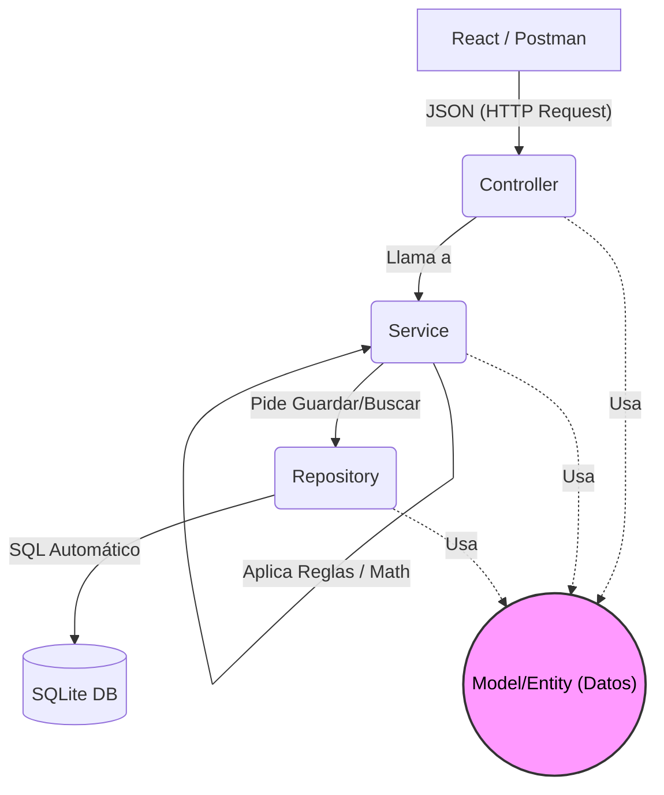

# Fases de Desarrollo del Sistema de Inventario

Este documento detalla la secuencia de pasos para llevar a cabo el proyecto, utilizando una **Arquitectura en Capas (Layered Architecture)** en el Backend (la evolución moderna y robusta del modelo MVC para APIs REST) y una **Arquitectura Basada en Componentes** en el Frontend (React).

## Backend: Arquitectura en Capas
El backend en Spring Boot no devolverá "vistas HTML" (eso era el MVC clásico). En su lugar, se comportará como una API REST pura, estructurada en 4 capas principales:
1. **Model/Entity (Capa de Datos):** Representación de las tablas de la base de datos en objetos Java (Ej. `Usuario.java`).
2. **Repository (Capa de Acceso a Datos):** Interfaces que conectan la base de datos con Java (queries a SQLite).
3. **Service (Capa de Negocio):** Aquí viven las reglas (ej. matemáticas de inventario, validar si hay stock, `@Transactional`).
4. **Controller (Capa de Presentación/API):** Recibe las peticiones (URLs/Endpoints) y devuelve respuestas en formato JSON.

### Flujo de la Arquitectura (Diagrama)

*Nota: El **Model (Entidad)** no ejecuta acciones, es simplemente el "paquete" de información que viaja entre todas las capas.*

---

## FASES DEL PROYECTO

### Fase 1: Configuración Base y Base de Datos (Backend)
- [x] Crear el esqueleto del proyecto en Spring Boot.
- [x] Configurar la conexión a SQLite.
- [x] Crear entidades base (`Rol`, `Usuario`).
- [ ] Crear el resto de entidades del inventario.

### Fase 2: Lógica de Acceso y Servicios (Backend)
- [ ] Crear las interfaces `Repository` para interactuar con SQLite (CRUD).
- [ ] Implementar la capa `Service` para los insumos.
- [ ] Implementar la capa `Service` para los movimientos (con transaccionalidad y control de stock).

### Fase 3: Exposición de la API y Seguridad (Backend)
- [ ] Crear los `Controllers` (endpoints REST).
- [ ] Manejo de errores centralizado (`@RestControllerAdvice`) (Devolver JSONs limpios en lugar de crasheos).
- [ ] Implementar Spring Security y Autenticación (Tokens JWT).
- [ ] Probar toda la API utilizando **Postman**.

### Fase 4: Preparación del Frontend (React)
- [ ] Inicializar proyecto React (Vite).
- [ ] Configurar diseño (Tailwind CSS) y enrutador (React Router).

### Fase 5: Desarrollo de Interfaz de Usuario (Frontend)
- [ ] Pantallas: Login, Dashboard, Catálogo de Insumos, Movimientos (Ingresos, Egresos, Ajustes).

### Fase 6: Pruebas Finales y Empaquetado
- [ ] Pruebas unitarias en backend.
- [ ] Compilación y Despliegue.
