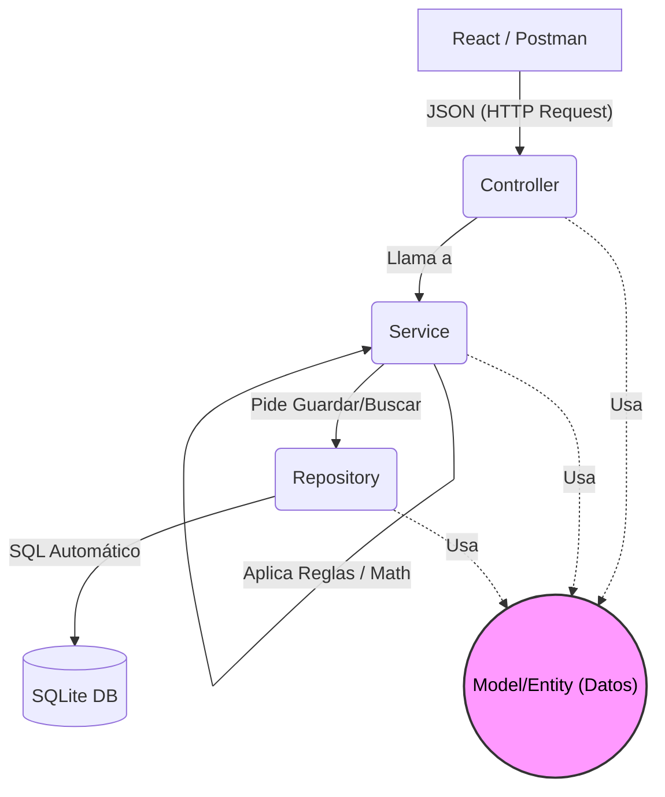

# Fases de Desarrollo del Sistema de Inventario

Este documento detalla la secuencia de pasos para llevar a cabo el proyecto, utilizando una **Arquitectura en Capas (Layered Architecture)** en el Backend (la evolución moderna y robusta del modelo MVC para APIs REST) y una **Arquitectura Basada en Componentes** en el Frontend (React).

## Backend: Arquitectura en Capas
El backend en Spring Boot no devolverá "vistas HTML" (eso era el MVC clásico). En su lugar, se comportará como una API REST pura, estructurada en 4 capas principales:
1. **Model/Entity (Capa de Datos):** Representación de las tablas de la base de datos en objetos Java (Ej. `Usuario.java`).
2. **Repository (Capa de Acceso a Datos):** Interfaces que conectan la base de datos con Java (queries a SQLite).
3. **Service (Capa de Negocio):** Aquí viven las reglas (ej. matemáticas de inventario, validar si hay stock, `@Transactional`).
4. **Controller (Capa de Presentación/API):** Recibe las peticiones (URLs/Endpoints) y devuelve respuestas en formato JSON.

### Flujo de la Arquitectura (Diagrama)

*Nota: El **Model (Entidad)** no ejecuta acciones, es simplemente el "paquete" de información que viaja entre todas las capas.*

---

## FASES DEL PROYECTO

### Fase 1: Configuración Base y Base de Datos (Backend)
- [x] Crear el esqueleto del proyecto en Spring Boot.
- [x] Configurar la conexión a SQLite.
- [x] Crear entidades base (`Rol`, `Usuario`).
- [x] Crear el resto de entidades del inventario (`Insumo`, `Movimiento`, `SaldoMensual`, `RequerimientoAnual`).
- [x] Seeder de datos iniciales (`DataSeeder`: roles y usuario ADMIN).

### Fase 2: Lógica de Acceso y Servicios (Backend)
- [x] Crear las interfaces `Repository` para interactuar con SQLite (CRUD).
- [x] Implementar la capa `Service` para los insumos.
- [x] Implementar la capa `Service` para los movimientos (con transaccionalidad y control de stock).

### Fase 3: Exposición de la API y Seguridad (Backend)
- [x] Crear los `Controllers` (endpoints REST).
- [x] Manejo de errores centralizado (`@RestControllerAdvice`) (Devolver JSONs limpios en lugar de crasheos).
- [x] Implementar Spring Security y Autenticación (Tokens JWT).
- [x] Probar toda la API utilizando **Postman**.

### Fase 4: Preparación del Frontend (React)
- [x] Inicializar proyecto React (Vite).
- [x] Configurar diseño (Tailwind CSS) y enrutador (React Router).

### Fase 5: Desarrollo de Interfaz de Usuario (Frontend)
- [x] Pantallas: Login, Dashboard, Catálogo de Insumos, Movimientos (Ingresos, Egresos, Ajustes).

### Fase 6: Pruebas Finales y Empaquetado
- [x] Pruebas unitarias en backend (`MovimientoServiceTest`).
- [ ] Pruebas integrales de los flujos completos (E2E).
- [ ] Compilación y Despliegue (Docker).

### Fase 9: Reportería PDF / Excel
- [x] Endpoints `POST /api/reportes/pdf` y `POST /api/reportes/excel`.
- [x] Exportación de movimientos filtrados (PDF con OpenPDF, Excel con Apache POI).
- [x] Descarga desde el frontend (`Reportes.tsx`) y filtros cruzados en memoria.

### Fase 10: Módulo Beta de Proyecciones (Smart Restock)
- [x] Lógica `Déficit = Stock Máximo - Stock Actual` e `Inversión = Déficit * Costo Estimado`.
- [x] Endpoints `POST /api/reportes/proyecciones/pdf` y `/excel`.
- [x] Pantalla `Proyecciones.tsx` con resumen financiero y exportaciones.
- [ ] Definir criterios avanzados de `stockMinimo`/`stockMaximo` por insumo.

### Fase 11: Módulo de Gestión de Usuarios
- [x] Panel de control del Administrador para crear usuarios (`UsuarioModal`).
- [x] Activar/suspender usuarios (`activo = true/false`) sin borrar historial.
- [x] Endpoints `GET/POST /api/usuarios/admin` y `PUT /api/usuarios/admin/{id}/status`.

### Fase 11.1: Control de Acceso por Roles (ACL)
- [x] Matriz centralizada de accesos en `frontend/src/access.ts`.
- [x] Filtrado del menú lateral por rol (`Layout.tsx`).
- [x] Protección de rutas por rol (`RequireRole`) para impedir acceso por URL.
- [x] Normalización de roles en mayúsculas (`ADMIN`, `JEFE`, `AUXILIAR`) en backend y frontend.
- [ ] (Pendiente) Reforzar los endpoints del backend con `@PreAuthorize` (seguridad a nivel de API).

### Fase 12: Recuperación de Contraseña (Código por Correo Electrónico)
- **Objetivo:** Permitir al usuario restablecer su contraseña mediante un **código de verificación enviado a su correo electrónico**.
- **Backend:**
  - [ ] Agregar dependencia `spring-boot-starter-mail` y configurar SMTP en `application.properties` (`spring.mail.*`).
  - [ ] Entidad `PasswordResetToken`: `id`, `usuario_id`, `codigo_hash`, `expiracion`, `usado`.
  - [ ] `POST /api/auth/recuperar` — recibe el email, genera un código de 6 dígitos, lo guarda **hasheado (BCrypt)** con expiración (~10 min) y lo envía por correo vía `JavaMailSender`.
  - [ ] `POST /api/auth/verificar-codigo` — valida que el código exista, no esté vencido ni usado.
  - [ ] `POST /api/auth/restablecer` — valida el código y actualiza el `password_hash` del usuario (marcando el token como usado).
  - [ ] Seguridad: respuesta genérica (no revelar si el email existe), límite de intentos/intentos fallidos y expiración de código para evitar fuerza bruta.
- **Frontend:**
  - [ ] Pantalla "¿Olvidaste tu contraseña?" (ingresar email).
  - [ ] Pantalla "Ingresar código de verificación".
  - [ ] Pantalla "Nueva contraseña" y confirmación.
  - [ ] Servicio Axios para los tres endpoints.

---

## Estado General

| Fase | Descripción                        | Estado      |
| ---- | ---------------------------------- | ----------- |
| 1-6  | Base, API, Seguridad, Frontend     | Completada  |
| 9    | Reportería PDF/Excel               | Completada  |
| 10   | Proyecciones (Smart Restock)       | Completada  |
| 11   | Gestión de Usuarios                | Completada  |
| 11.1 | Control de Acceso por Roles (ACL)  | Completada  |
| 12   | Recuperación de Contraseña         | **Pendiente** |
