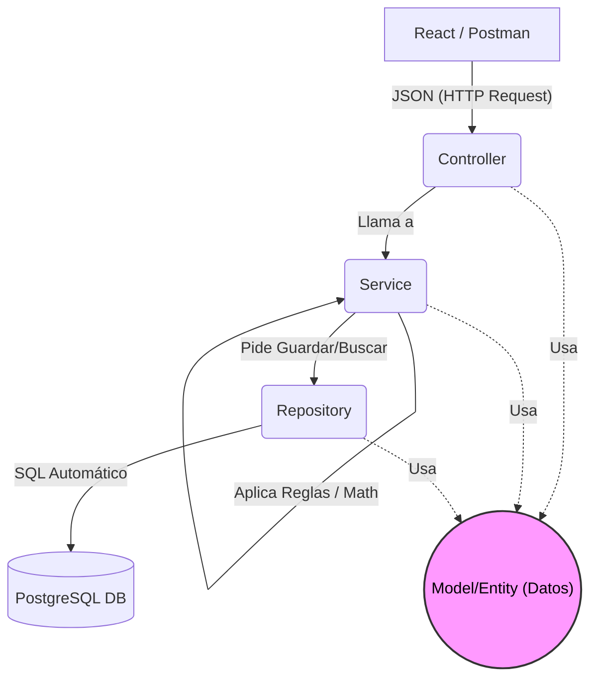

# Fases de Desarrollo del Sistema de Inventario

Este documento detalla la secuencia de pasos para llevar a cabo el proyecto, utilizando una **Arquitectura en Capas (Layered Architecture)** en el Backend (la evolución moderna y robusta del modelo MVC para APIs REST) y una **Arquitectura Basada en Componentes** en el Frontend (React).

## Backend: Arquitectura en Capas
El backend en Spring Boot no devolverá "vistas HTML" (eso era el MVC clásico). En su lugar, se comportará como una API REST pura, estructurada en 4 capas principales:
1. **Model/Entity (Capa de Datos):** Representación de las tablas de la base de datos en objetos Java (Ej. `Usuario.java`).
2. **Repository (Capa de Acceso a Datos):** Interfaces que conectan la base de datos con Java (queries a PostgreSQL).
3. **Service (Capa de Negocio):** Aquí viven las reglas (ej. matemáticas de inventario, validar si hay stock, `@Transactional`).
4. **Controller (Capa de Presentación/API):** Recibe las peticiones (URLs/Endpoints) y devuelve respuestas en formato JSON.

### Flujo de la Arquitectura (Diagrama)

*Nota: El **Model (Entidad)** no ejecuta acciones, es simplemente el "paquete" de información que viaja entre todas las capas.*

---

## FASES DEL PROYECTO

### Fase 1: Configuración Base y Base de Datos (Backend)
- [x] Crear el esqueleto del proyecto en Spring Boot.
- [x] Configurar la conexión a PostgreSQL.
- [x] Crear entidades base (`Rol`, `Usuario`).
- [x] Crear el resto de entidades del inventario (`Insumo`, `Movimiento`, `SaldoMensual`, `RequerimientoAnual`).
- [x] Seeder de datos iniciales (`DataSeeder`: roles y usuario ADMIN).

### Fase 2: Lógica de Acceso y Servicios (Backend)
- [x] Crear las interfaces `Repository` para interactuar con PostgreSQL (CRUD).
- [x] Implementar la capa `Service` para los insumos.
- [x] Implementar la capa `Service` para los movimientos (con transaccionalidad y control de stock).

### Fase 3: Exposición de la API y Seguridad (Backend)
- [x] Crear los `Controllers` (endpoints REST).
- [x] Manejo de errores centralizado (`@RestControllerAdvice`) (Devolver JSONs limpios en lugar de crasheos).
- [x] Implementar Spring Security y Autenticación (Tokens JWT).
- [x] Probar toda la API utilizando **Postman**.

### Fase 4: Preparación del Frontend (React)
- [x] Inicializar proyecto React (Vite).
- [x] Configurar diseño (Tailwind CSS) y enrutador (React Router).

### Fase 5: Desarrollo de Interfaz de Usuario (Frontend)
- [x] Pantallas: Login, Dashboard, Catálogo de Insumos, Movimientos (Ingresos, Egresos, Ajustes).

### Fase 6: Pruebas Finales y Empaquetado
- [x] Pruebas unitarias en backend (`MovimientoServiceTest`).
- [x] Pruebas integrales de los flujos completos (E2E): `scripts/smoke_test_e2e.py` (56 aserciones: auth, usuarios CRUD+cambio de rol, insumos, motor transaccional con validaciones de stock, control de acceso por rol y reportería Excel/PDF/Proyecciones). Limpieza con `scripts/limpiar_e2e.sql`.
- [x] Compilación y Despliegue (Docker): `docker compose up --build` levanta db + backend + frontend (Fase 14).

### Fase 9: Reportería PDF / Excel
- [x] Endpoints `POST /api/reportes/pdf` y `POST /api/reportes/excel`.
- [x] Exportación de movimientos filtrados (PDF con OpenPDF, Excel con Apache POI).
- [x] Descarga desde el frontend (`Reportes.tsx`) y filtros cruzados en memoria.

### Fase 10: Módulo Beta de Proyecciones (Smart Restock)
- [x] Lógica `Déficit = Stock Máximo - Stock Actual` e `Inversión = Déficit * Costo Estimado`.
- [x] Endpoints `POST /api/reportes/proyecciones/pdf` y `/excel`.
- [x] Pantalla `Proyecciones.tsx` con resumen financiero y exportaciones.
- [x] Criterios avanzados de `stockMinimo`/`stockMaximo` según consumo: `GET /api/insumos/sugerencias-stock` (`SugerenciaStockService`) infiere el consumo promedio diario de los movimientos (salidas + ajustes negativos en la ventana configurable, por defecto 90 días) y sugiere el punto de reorden (mínimo = CPD × 7 días) y la meta de compra (máximo = CPD × 37 días). El ADMIN puede aplicar cada sugerencia desde `Proyecciones.tsx`; parámetros configurables `inventario.proyeccion.*` en `application.properties`.

### Fase 11: Módulo de Gestión de Usuarios
- [x] Panel de control del Administrador para crear usuarios (`UsuarioModal`).
- [x] Activar/suspender usuarios (`activo = true/false`) sin borrar historial.
- [x] Endpoints `GET/POST /api/usuarios/admin` y `PUT /api/usuarios/admin/{id}/status`.

### Fase 11.1: Control de Acceso por Roles (ACL)
- [x] Matriz centralizada de accesos en `frontend/src/access.ts`.
- [x] Filtrado del menú lateral por rol (`Layout.tsx`).
- [x] Protección de rutas por rol (`RequireRole`) para impedir acceso por URL.
- [x] Normalización de roles en mayúsculas (`ADMIN`, `JEFE`, `AUXILIAR`) en backend y frontend.
- [x] Reforzar los endpoints del backend con `@PreAuthorize` (seguridad a nivel de API).

### Fase 12: Recuperación de Contraseña (Código por Correo Electrónico)
- **Objetivo:** Permitir al usuario restablecer su contraseña mediante un **código de verificación enviado a su correo electrónico**.
- **Backend:**
  - [x] Agregar dependencia `spring-boot-starter-mail` y configurar SMTP en `application.properties` (`spring.mail.*`).
  - [x] Entidad `PasswordResetToken`: `id`, `usuario_id`, `codigo_hash`, `expiracion`, `usado`, `intentos_fallidos`.
  - [x] Migración Flyway `V2__password_reset_tokens.sql`.
  - [x] `POST /api/auth/recuperar` — recibe el email, genera un código de 6 dígitos, lo guarda **hasheado (BCrypt)** con expiración (~10 min) y lo envía por correo vía `JavaMailSender`.
  - [x] `POST /api/auth/verificar-codigo` — valida que el código exista, no esté vencido ni usado (máx. 5 intentos fallidos).
  - [x] `POST /api/auth/restablecer` — valida el código y actualiza el `password_hash` del usuario (marcando el token como usado).
  - [x] Seguridad: respuesta genérica (no revelar si el email existe), límite de intentos fallidos y expiración de código para evitar fuerza bruta.
  - [x] Credenciales SMTP en `.env` (gitignored) + plantilla `.env.example`.
- **Frontend:**
  - [x] Pantalla wizard `/recuperar` en 3 pasos: ingresar email → ingresar código → nueva contraseña.
  - [x] Servicio Axios para los tres endpoints (`api.post("/auth/...")`).
  - [x] Enlace "¿Olvidaste tu contraseña?" desde el Login.

### Fase 13: Gestión de Usuarios — Actualizar Datos y Cambio de Rol
- **Objetivo:** Completar el CRUD de usuarios: poder **editar los datos** (ej. correo) de un usuario existente y **cambiar su rol** (ej. un auxiliar que pasa a jefe), de modo que sus permisos se actualicen de inmediato.
- **Backend:**
  - [x] `PUT /api/usuarios/admin/{id}` — actualizar nombre/email (validando unicidad del correo y sin permitir duplicados).
  - [x] `PUT /api/usuarios/admin/{id}/rol` — cambiar el rol del usuario (con validaciones: no quitarse rol a sí mismo el admin, roles válidos `ADMIN`/`JEFE`/`AUXILIAR`).
  - [x] Validaciones: el admin no puede degradar/suspender su propia cuenta.
- **Frontend:**
  - [x] Botón "Editar" en la tabla de usuarios que abre el `UsuarioModal` precargado para actualizar datos y/o cambiar rol.
  - [x] Selector de rol en el modal (según matriz de permisos).
  - [x] Refrescar la tabla y reflejar el nuevo rol/permisos del menú al recargar.
- **Nota:** mantener el "suspender" (activo) existente; esta fase lo complementa con actualización y cambio de rol.

### Fase 14: Imagen Docker del Frontend y Despliegue Único
- **Objetivo:** Contenerizar el frontend React (build estático servido con Nginx) y levantar **backend + frontend + base de datos** con un solo `docker compose up --build`.
- **Backend:** [x] Ya existe `Dockerfile` y perfil `prod` (PostgreSQL + Flyway).
- **Frontend:**
  - [x] Crear `frontend/Dockerfile` (multi-stage: `node:22-alpine` build + `nginx:alpine` con configuración para SPA).
  - [x] Configuración de Nginx: servidor estático + *fallback* a `index.html` para rutas SPA (React Router).
  - [x] Usar variable `VITE_API_URL` en el build (o proxy `/api` hacia el backend) para que el contenedor apunte al backend del compose.
  - [x] Agregar servicio `frontend` en `docker-compose.prod.yml` (puerto `80` o `5173`) con `depends_on: backend`.
- **Documentación:**
  - [x] Actualizar `COMO_LEVANTAR_LOS_SERVICIOS.md` y `README.md` con el modo "todo en Docker" (`docker compose up --build`).
- **Resultado:** una sola URL (ej. `http://localhost`) sirve la app completa; el modo dev de React queda solo para desarrollo.

---

## Estado General

| Fase | Descripción                        | Estado      |
| ---- | ---------------------------------- | ----------- |
| 1-6  | Base, API, Seguridad, Frontend     | Completada  |
| 9    | Reportería PDF/Excel               | Completada  |
| 10   | Proyecciones (Smart Restock)       | Completada  |
| 11   | Gestión de Usuarios                | Completada  |
| 11.1 | Control de Acceso por Roles (ACL)  | Completada  |
| 12   | Recuperación de Contraseña         | **Completada** |
| 13   | Gestión de Usuarios: actualizar + rol | **Completada** |
| 14   | Imagen Docker del Frontend         | **Completada** |
