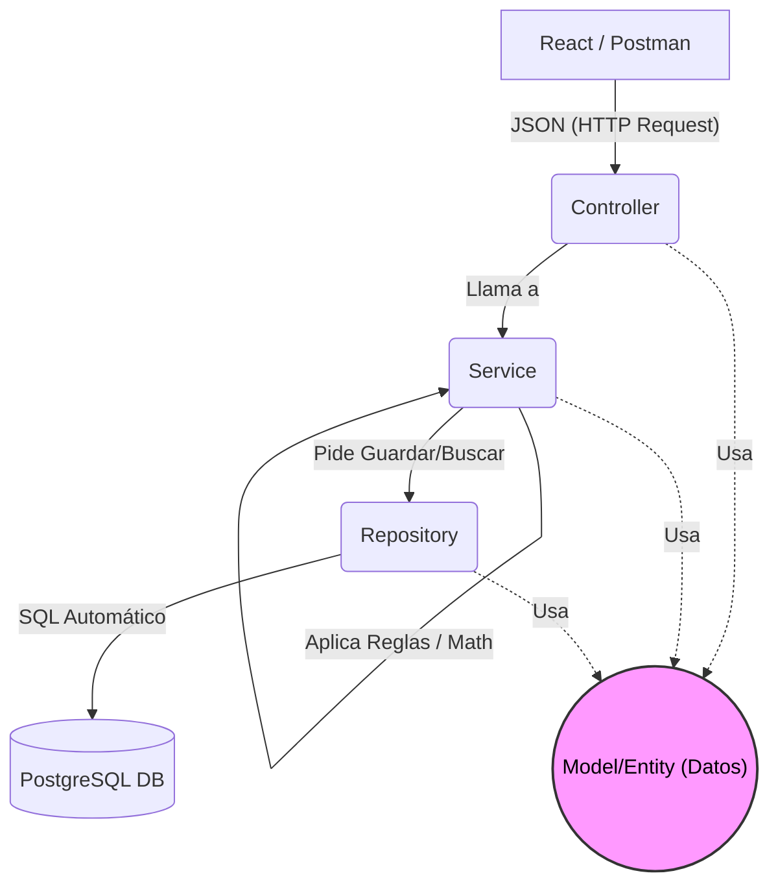

# Fases de Desarrollo del Sistema de Inventario

Este documento detalla la secuencia de pasos para llevar a cabo el proyecto, utilizando una **Arquitectura en Capas (Layered Architecture)** en el Backend (la evolución moderna y robusta del modelo MVC para APIs REST) y una **Arquitectura Basada en Componentes** en el Frontend (React).

## Backend: Arquitectura en Capas
El backend en Spring Boot no devolverá "vistas HTML" (eso era el MVC clásico). En su lugar, se comportará como una API REST pura, estructurada en 4 capas principales:
1. **Model/Entity (Capa de Datos):** Representación de las tablas de la base de datos en objetos Java (Ej. `Usuario.java`).
2. **Repository (Capa de Acceso a Datos):** Interfaces que conectan la base de datos con Java (queries a PostgreSQL).
3. **Service (Capa de Negocio):** Aquí viven las reglas (ej. matemáticas de inventario, validar si hay stock, `@Transactional`).
4. **Controller (Capa de Presentación/API):** Recibe las peticiones (URLs/Endpoints) y devuelve respuestas en formato JSON.

### Flujo de la Arquitectura (Diagrama)

*Nota: El **Model (Entidad)** no ejecuta acciones, es simplemente el "paquete" de información que viaja entre todas las capas.*

---

## FASES DEL PROYECTO

### Fase 1: Configuración Base y Base de Datos (Backend)
- [x] Crear el esqueleto del proyecto en Spring Boot.
- [x] Configurar la conexión a PostgreSQL.
- [x] Crear entidades base (`Rol`, `Usuario`).
- [x] Crear el resto de entidades del inventario (`Insumo`, `Movimiento`, `SaldoMensual`, `RequerimientoAnual`).
- [x] Seeder de datos iniciales (`DataSeeder`: roles y usuario ADMIN).

### Fase 2: Lógica de Acceso y Servicios (Backend)
- [x] Crear las interfaces `Repository` para interactuar con PostgreSQL (CRUD).
- [x] Implementar la capa `Service` para los insumos.
- [x] Implementar la capa `Service` para los movimientos (con transaccionalidad y control de stock).

### Fase 3: Exposición de la API y Seguridad (Backend)
- [x] Crear los `Controllers` (endpoints REST).
- [x] Manejo de errores centralizado (`@RestControllerAdvice`) (Devolver JSONs limpios en lugar de crasheos).
- [x] Implementar Spring Security y Autenticación (Tokens JWT).
- [x] Probar toda la API utilizando **Postman**.

### Fase 4: Preparación del Frontend (React)
- [x] Inicializar proyecto React (Vite).
- [x] Configurar diseño (Tailwind CSS) y enrutador (React Router).

### Fase 5: Desarrollo de Interfaz de Usuario (Frontend)
- [x] Pantallas: Login, Dashboard, Catálogo de Insumos, Movimientos (Ingresos, Egresos, Ajustes).

### Fase 6: Pruebas Finales y Empaquetado
- [x] Pruebas unitarias en backend (`MovimientoServiceTest`).
- [x] Pruebas integrales de los flujos completos (E2E): `scripts/smoke_test_e2e.py` (56 aserciones: auth, usuarios CRUD+cambio de rol, insumos, motor transaccional con validaciones de stock, control de acceso por rol y reportería Excel/PDF/Proyecciones). Limpieza con `scripts/limpiar_e2e.sql`.
- [x] Compilación y Despliegue (Docker): `docker compose up --build` levanta db + backend + frontend (Fase 14).

### Fase 9: Reportería PDF / Excel
- [x] Endpoints `POST /api/reportes/pdf` y `POST /api/reportes/excel`.
- [x] Exportación de movimientos filtrados (PDF con OpenPDF, Excel con Apache POI).
- [x] Descarga desde el frontend (`Reportes.tsx`) y filtros cruzados en memoria.

### Fase 10: Módulo Beta de Proyecciones (Smart Restock)
- [x] Lógica `Déficit = Stock Máximo - Stock Actual` e `Inversión = Déficit * Costo Estimado`.
- [x] Endpoints `POST /api/reportes/proyecciones/pdf` y `/excel`.
- [x] Pantalla `Proyecciones.tsx` con resumen financiero y exportaciones.
- [x] Criterios avanzados de `stockMinimo`/`stockMaximo` según consumo: `GET /api/insumos/sugerencias-stock` (`SugerenciaStockService`) infiere el consumo promedio diario de los movimientos (salidas + ajustes negativos en la ventana configurable, por defecto 90 días) y sugiere el punto de reorden (mínimo = CPD × 7 días) y la meta de compra (máximo = CPD × 37 días). El ADMIN puede aplicar cada sugerencia desde `Proyecciones.tsx`; parámetros configurables `inventario.proyeccion.*` en `application.properties`.

### Fase 11: Módulo de Gestión de Usuarios
- [x] Panel de control del Administrador para crear usuarios (`UsuarioModal`).
- [x] Activar/suspender usuarios (`activo = true/false`) sin borrar historial.
- [x] Endpoints `GET/POST /api/usuarios/admin` y `PUT /api/usuarios/admin/{id}/status`.

### Fase 11.1: Control de Acceso por Roles (ACL)
- [x] Matriz centralizada de accesos en `frontend/src/access.ts`.
- [x] Filtrado del menú lateral por rol (`Layout.tsx`).
- [x] Protección de rutas por rol (`RequireRole`) para impedir acceso por URL.
- [x] Normalización de roles en mayúsculas (`ADMIN`, `JEFE`, `AUXILIAR`) en backend y frontend.
- [x] Reforzar los endpoints del backend con `@PreAuthorize` (seguridad a nivel de API).

### Fase 12: Recuperación de Contraseña (Código por Correo Electrónico)
- **Objetivo:** Permitir al usuario restablecer su contraseña mediante un **código de verificación enviado a su correo electrónico**.
- **Backend:**
  - [x] Agregar dependencia `spring-boot-starter-mail` y configurar SMTP en `application.properties` (`spring.mail.*`).
  - [x] Entidad `PasswordResetToken`: `id`, `usuario_id`, `codigo_hash`, `expiracion`, `usado`, `intentos_fallidos`.
  - [x] Migración Flyway `V2__password_reset_tokens.sql`.
  - [x] `POST /api/auth/recuperar` — recibe el email, genera un código de 6 dígitos, lo guarda **hasheado (BCrypt)** con expiración (~10 min) y lo envía por correo vía `JavaMailSender`.
  - [x] `POST /api/auth/verificar-codigo` — valida que el código exista, no esté vencido ni usado (máx. 5 intentos fallidos).
  - [x] `POST /api/auth/restablecer` — valida el código y actualiza el `password_hash` del usuario (marcando el token como usado).
  - [x] Seguridad: respuesta genérica (no revelar si el email existe), límite de intentos fallidos y expiración de código para evitar fuerza bruta.
  - [x] Credenciales SMTP en `.env` (gitignored) + plantilla `.env.example`.
- **Frontend:**
  - [x] Pantalla wizard `/recuperar` en 3 pasos: ingresar email → ingresar código → nueva contraseña.
  - [x] Servicio Axios para los tres endpoints (`api.post("/auth/...")`).
  - [x] Enlace "¿Olvidaste tu contraseña?" desde el Login.

### Fase 13: Gestión de Usuarios — Actualizar Datos y Cambio de Rol
- **Objetivo:** Completar el CRUD de usuarios: poder **editar los datos** (ej. correo) de un usuario existente y **cambiar su rol** (ej. un auxiliar que pasa a jefe), de modo que sus permisos se actualicen de inmediato.
- **Backend:**
  - [x] `PUT /api/usuarios/admin/{id}` — actualizar nombre/email (validando unicidad del correo y sin permitir duplicados).
  - [x] `PUT /api/usuarios/admin/{id}/rol` — cambiar el rol del usuario (con validaciones: no quitarse rol a sí mismo el admin, roles válidos `ADMIN`/`JEFE`/`AUXILIAR`).
  - [x] Validaciones: el admin no puede degradar/suspender su propia cuenta.
- **Frontend:**
  - [x] Botón "Editar" en la tabla de usuarios que abre el `UsuarioModal` precargado para actualizar datos y/o cambiar rol.
  - [x] Selector de rol en el modal (según matriz de permisos).
  - [x] Refrescar la tabla y reflejar el nuevo rol/permisos del menú al recargar.
- **Nota:** mantener el "suspender" (activo) existente; esta fase lo complementa con actualización y cambio de rol.

### Fase 14: Imagen Docker del Frontend y Despliegue Único
- **Objetivo:** Contenerizar el frontend React (build estático servido con Nginx) y levantar **backend + frontend + base de datos** con un solo `docker compose up --build`.
- **Backend:** [x] Ya existe `Dockerfile` y perfil `prod` (PostgreSQL + Flyway).
- **Frontend:**
  - [x] Crear `frontend/Dockerfile` (multi-stage: `node:22-alpine` build + `nginx:alpine` con configuración para SPA).
  - [x] Configuración de Nginx: servidor estático + *fallback* a `index.html` para rutas SPA (React Router).
  - [x] Usar variable `VITE_API_URL` en el build (o proxy `/api` hacia el backend) para que el contenedor apunte al backend del compose.
  - [x] Agregar servicio `frontend` en `docker-compose.prod.yml` (puerto `80` o `5173`) con `depends_on: backend`.
- **Documentación:**
  - [x] Actualizar `COMO_LEVANTAR_LOS_SERVICIOS.md` y `README.md` con el modo "todo en Docker" (`docker compose up --build`).
- **Resultado:** una sola URL (ej. `http://localhost`) sirve la app completa; el modo dev de React queda solo para desarrollo.

---

## Fases Nuevas (Mejoras y Refactorización)

> **Nota de planificación:** las Fases 16-18 se tocan entre sí (el rediseño de
> presentaciones crea tablas nuevas y la normalización a inglés renombra el
> resto). **Orden recomendado:** Fase 15 (independiente y corta) → Fase 16
> (presentaciones, diseñando ya con nombres en inglés) → Fases 17-18
> (normalización del resto) → Fase 19 (cierre).

### Fase 15: Toast de login exitoso
- **Objetivo:** reemplazar el mensaje nativo `alert("¡Login Exitoso! Token guardado.")` (`frontend/src/pages/Login.tsx`) por un **toast** de confirmación.
- **Est. de esfuerzo: ~2-3 horas** (baja complejidad, independiente).
- [x] Crear un toast global reutilizable: `frontend/src/store/useToastStore.ts` (zustand) + `frontend/src/components/Toast.tsx` (flotante, auto-dismiss), renderizado una sola vez en `Layout.tsx`.
- [x] En `Login.tsx`: al autenticar exitosamente, `showToast("Sesión iniciada correctamente", "success")` y luego navegar. El toast sobrevive a la navegación porque vive en el Layout.
- [x] (Opcional, recomendado) Migrar los toasts ad-hoc de `Insumos.tsx` y `Proyecciones.tsx` al mismo store para centralizar.

### Fase 16: Presentaciones múltiples por insumo (Catálogo + Variantes)
- **Pregunta resuelta:** *"¿registrar nuevamente la pasta térmica o crear una tabla de presentaciones?"* → **Opción B: tabla nueva `presentaciones`** (modelo normalizado). Registrar de nuevo (Opción A, el modelo actual) funciona hoy, pero no hay concepto de "el mismo material": se duplica el nombre por variante y es imposible agrupar/enforcar por material.
- **Modelo propuesto (con nombres ya en inglés):**
  - `items` (catálogo): `id, code, name, created_at, updated_at` — el material (ej. "Pasta Térmica").
  - `presentations` (variantes): `id, item_id FK, name, size, min_stock, max_stock, estimated_cost, stock, created_at, updated_at` — cada presentación (ej. "Sobre 2g", "Sobre 4g") con su propio stock.
  - Los **movimientos** apuntan a `presentations.id` (el stock se controla por variante, igual que hoy).
- **Est. de esfuerzo: ~1.5-2 días** (media-alta: toca entidades, FK de movimientos, DTOs, CRUD frontend y sugerencias).
- [x] Backend: migración Flyway `V3__presentaciones_multiples.sql` que crea `items` + `presentations`, migra los datos actuales de `inventario_insumos` (agrupando por `insumo` → un `item`; cada fila → una `presentation`, conservando los ids) y re-apunta `inventario_movimientos.inventario_id` → `presentations.id`. `inventario_insumos` se conserva como archivo legado (la referencian `inventario_saldos_mensuales` e `inventario_requerimientos_anuales`).
- [x] Backend: entidades `Item` y `Presentation` (+ `ItemRepository`, `PresentationRepository`); el stock/min/max/cost viven en la variante; `Movimiento` apunta a `Presentation`.
- [x] Backend: endpoints de catálogo (`GET/POST/PUT /api/items`, `GET/POST /api/items/{id}/presentations`, `PUT /api/presentations/{id}`) y adaptar `MovimientoController`, `SugerenciaStockService` y `ReporteController`. `GET /api/insumos` conserva el contrato aplanado legado (vista de presentaciones) para no romper el frontend.
- [x] Frontend: vista de catálogo con variantes (material → sus presentaciones: agregar/editar variante, editar material); selección de presentación en movimientos/ajustes; aplicar sugerencia vía `PUT /presentations/{id}`.
- [x] Validar: alta de material con varias presentaciones; movimientos por variante; sugerencias de stock por variante (E2E 58 PASS / 0 FAIL vía proxy `:80`).

### Fase 17: Normalización del esquema a inglés — Backend y Base de datos
- **Objetivo:** unificar a **inglés** todos los nombres de columnas/campos de la BD (hoy mezcla: `email`/`password` EN, `nombre`/`activo`/`detalle` ES).
- **Mapa de renombrado (columnas):**
  | Tabla | Columna actual → inglesa |
  |---|---|
  | `roles` | `nombre`→`name`, `nivel`→`level`, `descripcion`→`description` |
  | `usuarios` | `nombre`→`name`, `activo`→`active` |
  | `inventario_insumos` | `numero`→`code`, `insumo`→`name`, `presentacion`→`presentation`, `tamano_presentacion`→`size`, `entrada`→`entries`, `stock_minimo`→`min_stock`, `stock_maximo`→`max_stock`, `costo_estimado`→`estimated_cost` |
  | `inventario_movimientos` | `tipo`→`type`, `mes`→`month`, `anio`→`year`, `cantidad`→`quantity`, `detalle`→`detail` |
  | `inventario_saldos_mensuales` | `anio`→`year`, `mes`→`month`, `egresos`→`outflows` |
  | `inventario_requerimientos_anuales` | `anio`→`year`, `cantidad`→`quantity` |
  | `password_reset_tokens` | `codigo_hash`→`code_hash`, `expiracion`→`expires_at`, `usado`→`used`, `intentos_fallidos`→`failed_attempts` |
  - **Regla:** si Fase 16 ya creó `items`/`presentations`, las columnas de insumos se normalizan ahí directamente (no se renombran dos veces).
- **Est. de esfuerzo: ~1-1.5 días** (media; mueve modelos, DTOs, repositorios, servicios, controladores, seguridad y consultas).
- [x] Migración Flyway `V4__normalizar_schema_al_ingles.sql` con `ALTER TABLE ... RENAME COLUMN` (preserva datos; **NO** editar V1/V2/V3 para no romper checksums). Actualizadas referencias `database/postgres/*.sql`.
- [x] Renombrar campos en entidades (7): `Usuario`, `Rol`, `Insumo`, `Movimiento`, `SaldoMensual`, `RequerimientoAnual`, `PasswordResetToken` + `@Column(name=...)`.
- [x] Renombrar DTOs: `LoginResponse.UsuarioInfo`, `MovimientoResponseDTO`, `MovimientoDTO`, `ActualizarUsuarioDTO`, `NuevoUsuarioDTO`, `ProyeccionDTO`, `SugerenciaStockDTO`, `InsumoViewDTO`.
- [x] Renombrar repositorios/servicios/controladores/`UserDetailsServiceImpl` (getters/setters + `@Query` y validaciones).
- [x] Actualizar tests unitarios y `scripts/smoke_test_e2e.py` (nuevos nombres de campos).
- [x] Verificar: build Gradle + tests verdes + arranque con Flyway aplicando V4 sobre datos existentes (E2E 58 PASS / 0 FAIL vía proxy `:80`).

### Fase 18: Normalización del esquema a inglés — Frontend
- **Objetivo:** actualizar el contrato de la API en React (campos `nombre`, `activo`, `tipo`, `cantidad`, `detalle`, `presentacion`, `stockMinimo`, etc.).
- **Alcance estimado:** ~74 referencias en ~12 archivos (`access.ts`, `Layout.tsx`, `Login.tsx`, `Usuarios.tsx`, `UsuarioModal.tsx`, `Insumos.tsx`, `InsumoModal.tsx`, `Movimientos.tsx`, `MovimientoModal.tsx`, `Ajustes.tsx`, `AjusteModal.tsx`, `Dashboard.tsx`, `Reportes.tsx`, `Proyecciones.tsx`, `store/useAuthStore.ts`).
- **Est. de esfuerzo: ~1 día** (media; mecánico pero extenso).
- [ ] Renombrar todas las referencias de campos de la API a los nuevos nombres en inglés.
- [ ] Ajustar formularios (names de inputs), tablas, tarjetas del Dashboard, sugerencias de stock y reportes.
- [ ] Lint + build + E2E completo a través del proxy `:80`.

### Fase 19: Verificación E2E, documentación y cierre
- **Est. de esfuerzo: ~0.5 día.**
- [ ] Actualizar `scripts/smoke_test_e2e.py` y `scripts/limpiar_e2e.sql` a los nuevos nombres y estructura (items/presentations).
- [ ] Revisar y actualizar `README.md`, `ARQUITECTURA_PATRONES.md`, `MIGRACION_POSTGRESQL.md` y diagramas.
- [ ] Marcar fases completadas en este documento y `git commit`.

**Total estimado del paquete (15-19): ~4.5-6 días de trabajo neto.**
De ellos, la refactorización de normalización a inglés (17+18) suma **~2-2.5 días**, y las presentaciones (16) **~1.5-2 días**.

---

## Estado General

| Fase | Descripción                        | Estado      |
| ---- | ---------------------------------- | ----------- |
| 1-6  | Base, API, Seguridad, Frontend     | Completada  |
| 9    | Reportería PDF/Excel               | Completada  |
| 10   | Proyecciones (Smart Restock)       | Completada  |
| 11   | Gestión de Usuarios                | Completada  |
| 11.1 | Control de Acceso por Roles (ACL)  | Completada  |
| 12   | Recuperación de Contraseña         | **Completada** |
| 13   | Gestión de Usuarios: actualizar + rol | **Completada** |
| 14   | Imagen Docker del Frontend         | **Completada** |
| 15   | Toast de login exitoso             | **Completada** |
| 16   | Presentaciones múltiples por insumo| **Completada** |
| 17   | Normalización a inglés (Backend/BD)| **Completada** |
| 18   | Normalización a inglés (Frontend)  | Pendiente  |
| 19   | E2E, documentación y cierre        | Pendiente  |
