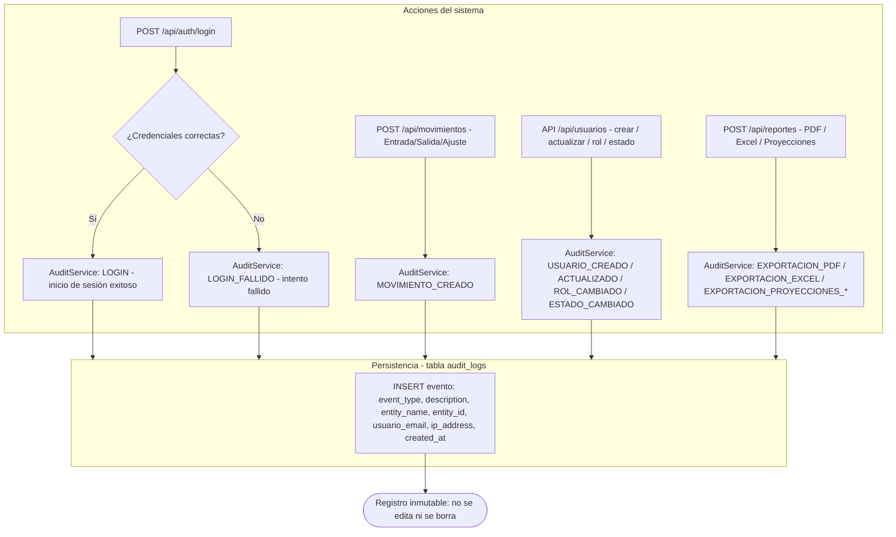
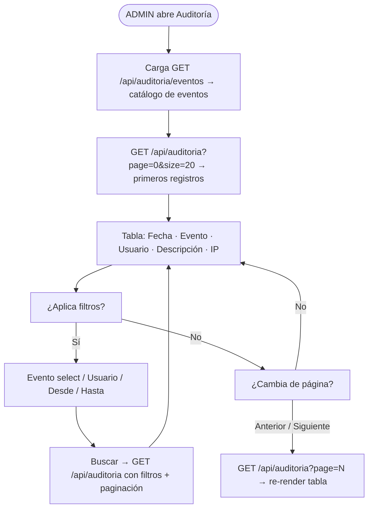
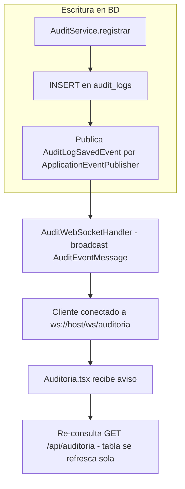

# Diagrama de Flujo — Módulo de Auditoría

**Módulo:** Auditoría del Sistema (bitácora de eventos)
**Endpoints:** `GET /api/auditoria`, `GET /api/auditoria/eventos`
**Acceso:** Solo **ADMIN** (backend: `@PreAuthorize("hasRole('ADMIN')")`)
**Fase:** 24 (Auditoría del Sistema)

> La escritura de eventos es **automática** e inmutable (append-only): los
> módulos de Login, Movimientos/Ajustes, Usuarios y Reportes notifican a
> `AuditService.registrar(...)` al ejecutar sus acciones. La UI solo consulta.

## 1. Escritura de eventos (automática, al ejecutar cada acción)

## 2. Consulta (página /auditoria, solo ADMIN)

## 2b. Notificación en tiempo real (WebSocket `/ws/auditoria`)

- El WebSocket es una **señal push** (id, tipo, descripción, fecha) que **no
  transporta datos sensibles**: el contenido se obtiene siempre por REST
  autenticado.
- El frontend se suscribe con `useAuditSocket` (reconexión cada 4s) y re-consulta
  la bitácora al recibir el aviso.
- `nginx.conf` proxifica `/ws/` con upgrade de conexión (HTTP/1.1, timeouts 3600s).

## 3. Reglas de la bitácora

1. Solo el **ADMIN** consulta (`/api/auditoria`); el resto de roles no lo ve ni
   en el menú (frontend `MODULE_ACCESS['/auditoria'] = [ADMIN]`).
2. Las filas **nunca se modifican ni se eliminan**: garantizan trazabilidad
   de quién hizo qué, cuándo y desde qué IP.
3. El `filtro por fechas` es inclusivo (Desde = 00:00 de ese día; Hasta =
   hasta el final de ese día).
4. El orden por defecto es **descendente por fecha** (lo más reciente primero).

**Archivos clave:** `backend/...#/AuditService.java`, `AuditController.java`,
`AuditLog.java`, migración `V7__auditoria.sql`, `frontend/src/pages/Auditoria.tsx`.