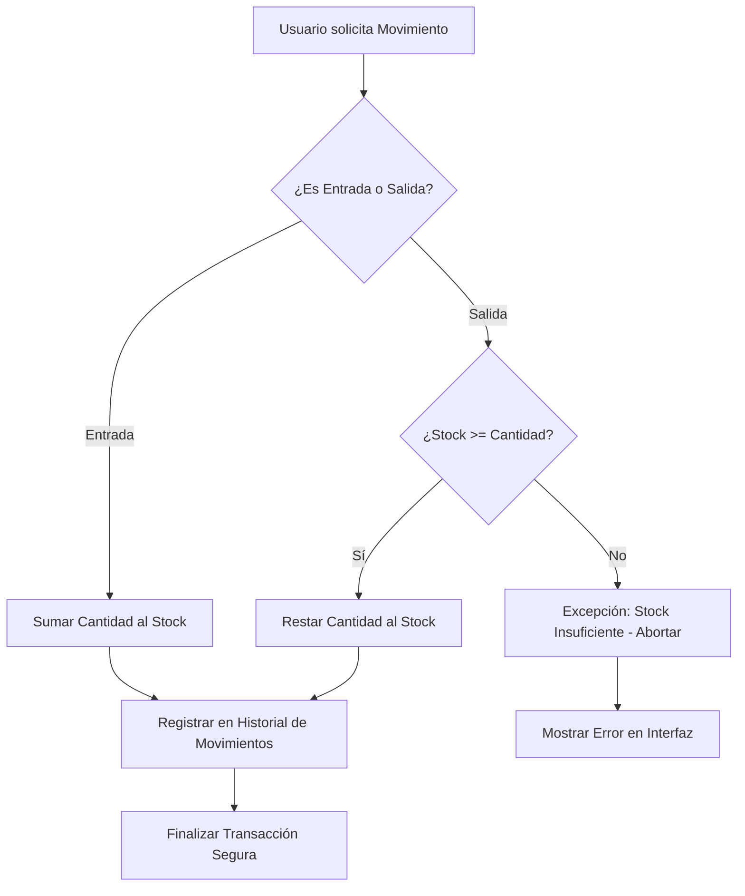
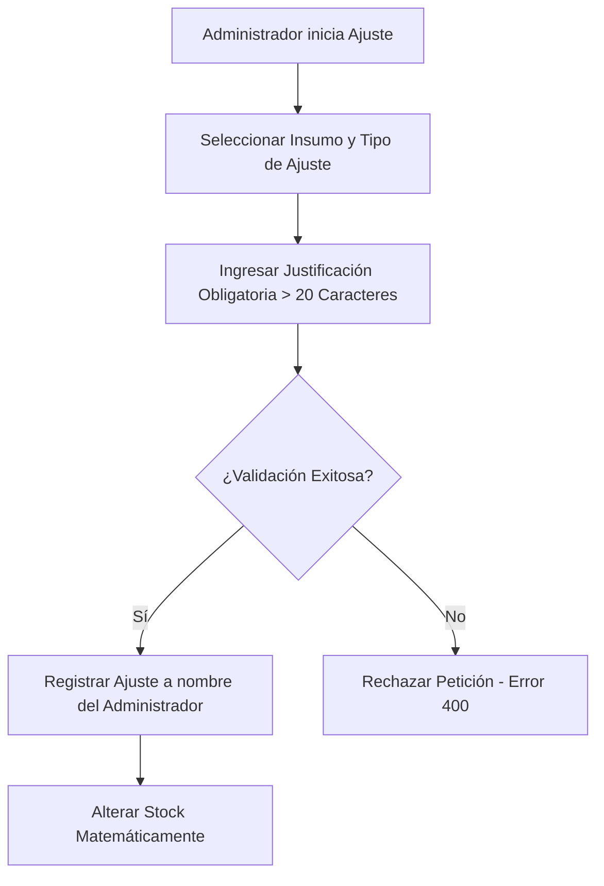
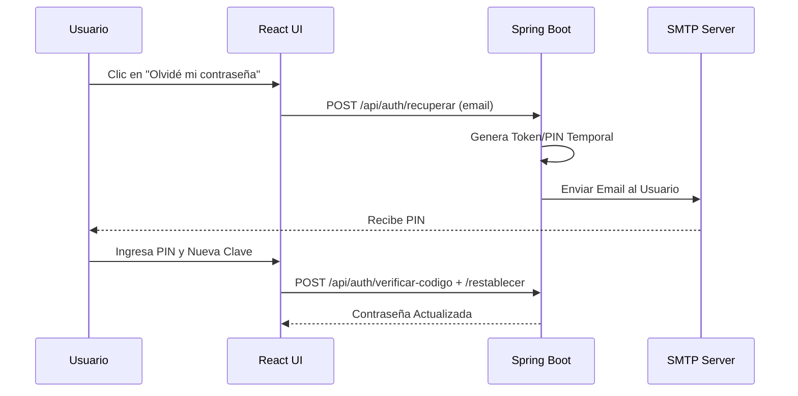

# Diagramas de Flujo del Sistema (Mermaid)

Este documento contiene los diagramas arquitectónicos y de flujo operativo del sistema.
Los flujos de cada módulo tienen un archivo propio; este documento los indexa:

## Índice de diagramas por módulo

| Módulo / Flujo | Archivo |
| -------------- | ------- |
| Autenticación — Login | [`flujo_login.md`](./flujo_login.md) |
| Autenticación — Recuperación de contraseña | [`flujo_recuperar_contrasena.md`](./flujo_recuperar_contrasena.md) |
| Movimientos (Kárdex y Transacciones) | sección 1 abajo |
| Ajustes (correcciones manuales de stock) | sección 2 abajo |
| Reportería (Excel) | sección 3 abajo |
| Auditoría del Sistema (bitácora de eventos) | [`flujo_auditoria.md`](./flujo_auditoria.md) |

---

## 1. Flujo de Módulo de Movimientos (Kárdex y Transacciones)

## 2. Flujo de Módulo de Ajustes (correcciones manuales de stock)

## 3. Flujo de Reportería (Generación Excel)

```mermaid
graph LR
    A[Usuario interactúa con Filtros React] --> B[Filtrado Local Dinámico]
    B --> C[Usuario presiona Exportar Excel]
    C --> D[React extrae Array de IDs filtrados]
    D --> E[POST /api/reportes/excel con IDs]
    E --> F[Spring Boot: MovimientoRepository.findAllById]
    F --> G[Apache POI: Dibuja celdas y estilos]
    G --> H[Respuesta Blob Binario xlsx]
    H --> I[Navegador Fuerza Descarga del Archivo]
```

## 4. Flujo de Recuperación de Contraseña (Fase 12)
> ✅ Implementado y documentado a detalle en
> [`flujo_recuperar_contrasena.md`](./flujo_recuperar_contrasena.md).
> Vista resumida (secuencia):

