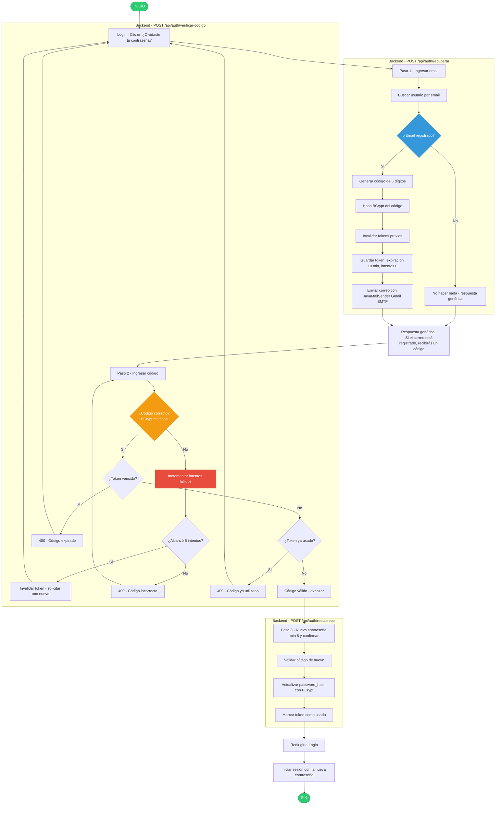

# Diagrama de Flujo — Recuperación de Contraseña

**Módulo:** Autenticación
**Endpoints:** `POST /api/auth/recuperar`, `POST /api/auth/verificar-codigo`, `POST /api/auth/restablecer`
**Fase:** 12 (Recuperación de Contraseña)

## Notas de Seguridad

- **Respuesta genérica:** el endpoint `/recuperar` nunca revela si el email existe (mitiga enumeración de cuentas).
- El código se guarda **hasheado con BCrypt**, nunca en texto plano.
- Expiración de **10 minutos** y máximo **5 intentos fallidos** (anti fuerza bruta).
- Cada código es de un solo uso; al solicitar uno nuevo se invalidan los anteriores.
- Credenciales SMTP desde `.env` (`MAIL_USERNAME`, `MAIL_PASSWORD`); nunca en el repositorio.
