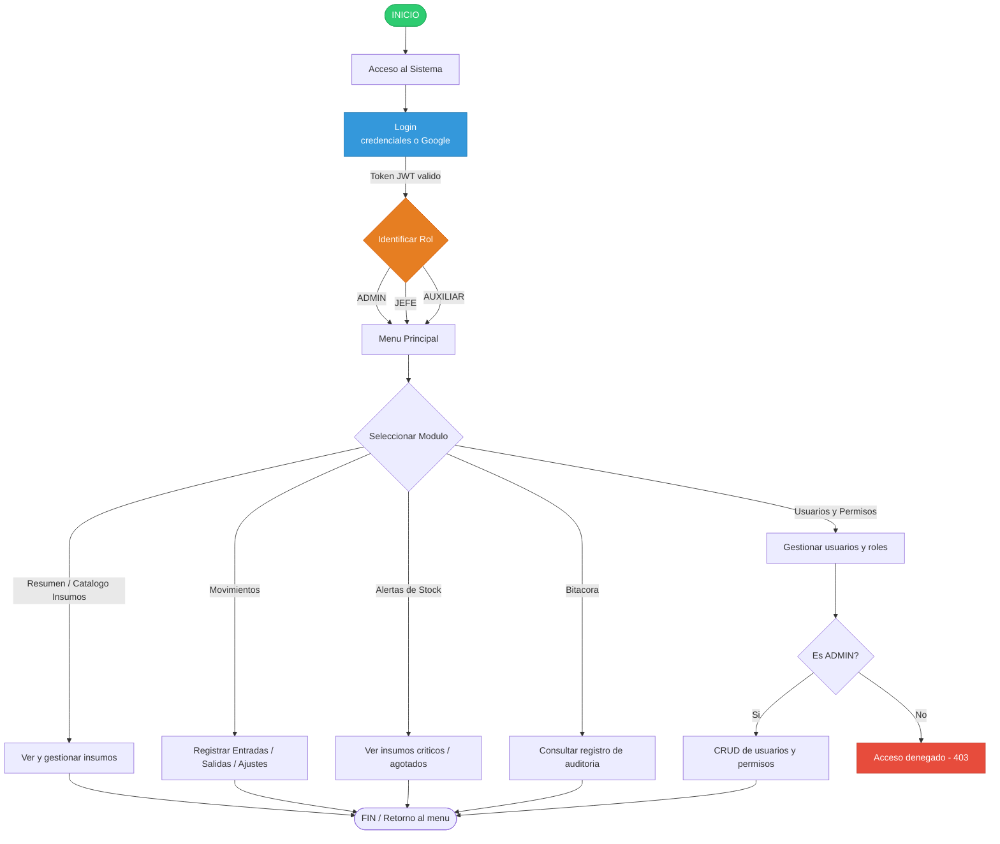
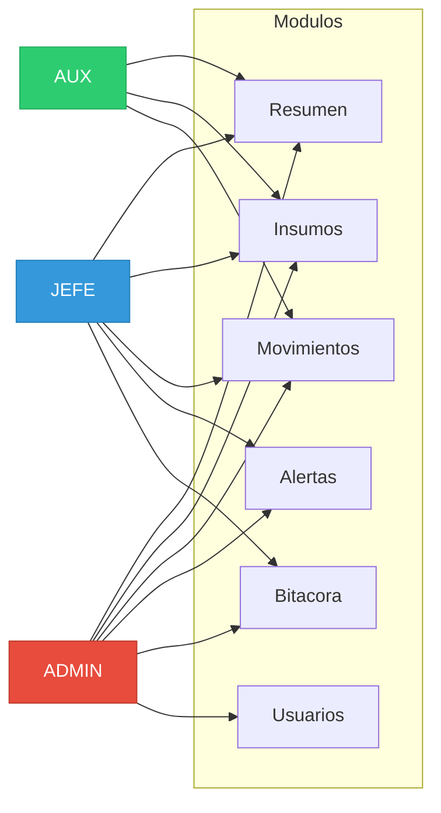
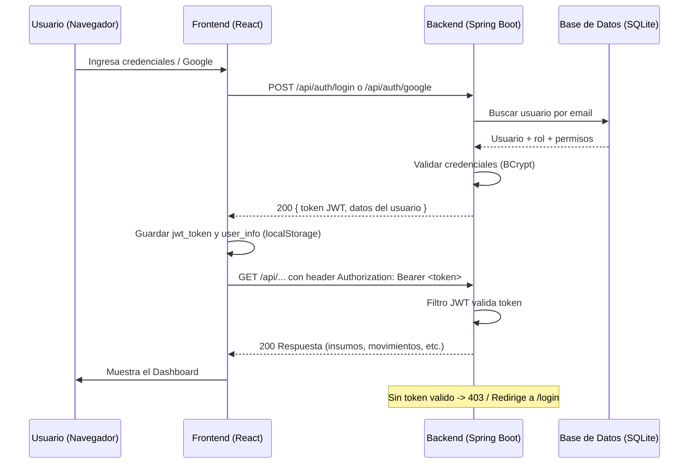

# Diagrama General del Sistema

## 1. Arquitectura del Sistema (Componentes)

```mermaid
flowchart LR
    subgraph Cliente["FRONTEND (React + Vite) - Puerto 5173"]
        UI[Paginas y Componentes]
        AUTH[AuthContext<br/>gestiona sesion / JWT]
        AX[Axios API Interceptor<br/>inyecta Authorization Bearer]
        LOGIN[Pagina Login]
        DASH[Dashboard + Modulos]
    end

    subgraph Servidor["BACKEND (Spring Boot) - Puerto 8080"]
        SEC[Spring Security<br/>Filtro JWT]
        CTRL[Controllers<br/>/api/...]
        SVC[Services<br/>reglas de negocio]
        REPO[Repositories<br/>JPA / Hibernate]
    end

    DB[("Base de Datos<br/>SQLite (inventario.db)")]

    UI --> LOGIN
    LOGIN --> AUTH
    AUTH --> DASH
    DASH --> AX
    AX -->|"HTTP + JWT"| SEC
    SEC --> CTRL
    CTRL --> SVC
    SVC --> REPO
    REPO --> DB

    style Cliente fill:#0b0f19,stroke:#3b82f6,color:#f9fafb
    style Servidor fill:#0b0f19,stroke:#10b981,color:#f9fafb
    style DB fill:#111827,stroke:#f59e0b,color:#f9fafb
```

## 2. Flujo General del Sistema (por Rol)

## 3. Acceso por Rol a los Módulos (matriz real del Dashboard)

## 4. Autenticación y Sesión (JWT)

