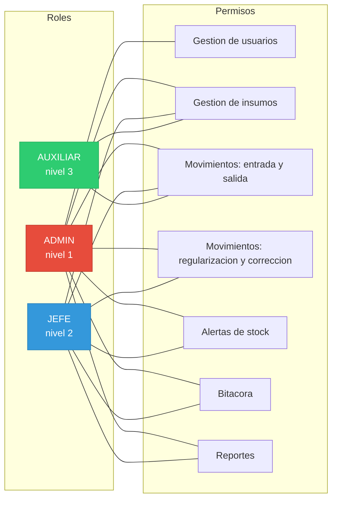
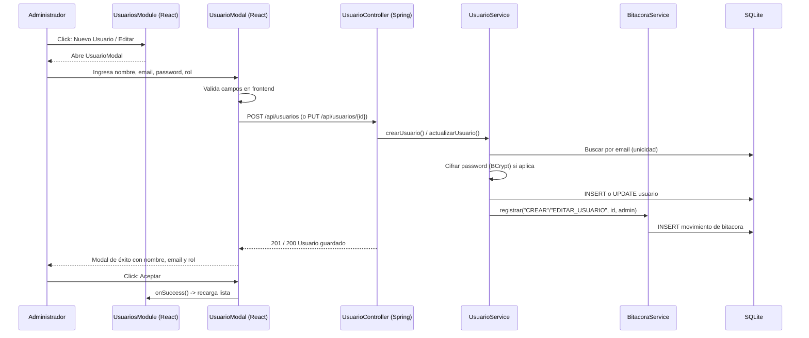

# Flujo de Gestión de Usuarios

Flujo real del módulo de usuarios (solo **ADMIN**): crear, editar y eliminar usuarios con asignación de roles y registro en bitácora.

## 1. Diagrama de Flujo (General)

```mermaid
flowchart TD
    A([INICIO: Modulo de Usuarios]) --> B{Es usuario ADMIN?}

    B -->|No| C[Acceso denegado<br/>el modulo no aparece en su menu]
    C --> D([FIN])

    B -->|Si| E[Ver lista de usuarios con sus roles]
    E --> F{Seleccionar accion}

    F -->|Crear usuario| G[Click: Nuevo Usuario]
    F -->|Editar usuario| H[Click en lápiz del usuario]
    F -->|Eliminar usuario| I[Click en papelera del usuario]

    G --> J[Se abre UsuarioModal en modo crear]
    H --> J1[Se abre UsuarioModal en modo editar<br/>con datos precargados]

    J --> K[Ingresar nombre, email, password y rol]
    J1 --> K1[Modificar nombre, email, rol o estado activo]

    K --> L{Validacion Frontend<br/>campos completos y email valido?}
    K1 --> L

    L -->|Invalido| M[Mostrar errores bajo cada campo]
    M --> K

    L -->|Valido| N[POST /api/usuarios o PUT /api/usuarios/{id}]
    N --> O{Email ya registrado?}

    O -->|Si (solo al crear)| P[409: Ya existe un usuario con ese email]
    P --> Q[Mostrar modal de error]
    Q --> K

    O -->|No| R[Cifrar password con BCrypt<br/>si fue cambiada]
    R --> S[Guardar usuario en la base de datos]
    S --> T[Registrar accion en bitacora<br/>CREAR o EDITAR]
    T --> U[Mostrar modal de exito<br/>nombre, email y rol]
    U --> V[Click: Aceptar]
    V --> W[Recargar lista de usuarios]
    W --> D

    I --> X[Se abre DeleteUsuarioModal]
    X --> Y[Ingresar justificacion de la eliminacion]
    Y --> Z[Click: Si, Eliminar]
    Z --> AA[DELETE /api/usuarios/{id}]
    AA --> AB[Soft delete: activo = false<br/>el usuario pierde acceso al sistema]
    AB --> AC[Registrar accion en bitacora<br/>ELIMINAR con justificacion]
    AC --> AD[Mostrar modal de exito]
    AD --> V

    style B fill:#e67e22,stroke:#d35400,color:#fff
    style C fill:#e74c3c,stroke:#c0392b,color:#fff
    style P fill:#e74c3c,stroke:#c0392b,color:#fff
```

## 2. Roles y Permisos del Sistema



## 3. Secuencia (Crear / Editar Usuario)



> **Nota:** la eliminación es **lógica (soft delete)**: el registro permanece en la base de datos con `activo = false` y ya no puede iniciar sesión.
