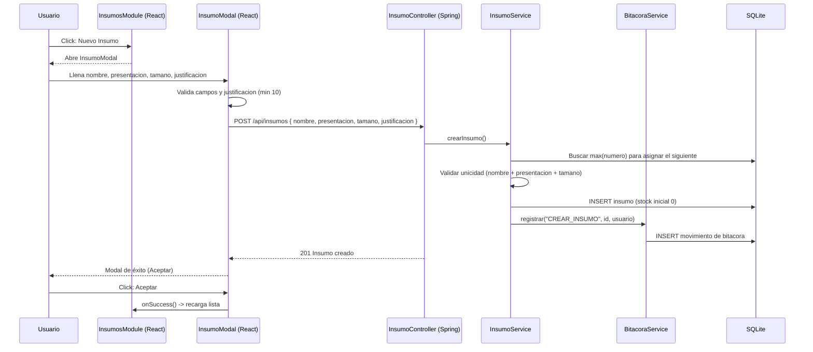

# Flujo de Ingreso de Insumo (Catálogo)

Flujo real para registrar un nuevo insumo en el catálogo: desde el módulo de insumos hasta su guardado en la base de datos, con justificación obligatoria y registro en bitácora.

## 1. Diagrama de Flujo

```mermaid
flowchart TD
    A([INICIO: Modulo de Insumos]) --> B[Click: Nuevo Insumo]
    B --> C[Se abre InsumoModal]

    C --> D[Completar formulario<br/>nombre, presentacion, tamano]
    D --> E[Ingresar justificacion<br/>minimo 10 caracteres]
    E --> F[Click: Guardar]

    F --> G{Validacion en Frontend<br/>campos completos?}
    G -->|Faltan campos| H[Mostrar errores en rojo bajo cada campo]
    H --> D

    G -->|Justificacion < 10 caracteres| I[Error: justificacion obligatoria<br/>minimo 10 caracteres]
    I --> D

    G -->|Valido| J[POST /api/insumos]
    J --> K{Validacion en Backend<br/>unicidad insumo + presentacion + tamano}

    K -->|Duplicado| L[409: Ya existe un insumo con esos datos]
    L --> M[Mostrar modal de error]
    M --> D

    K -->|Unico| N[Autogenerar numero de insumo<br/>max(numero) + 1]
    N --> O[Guardar insumo en la base de datos]
    O --> P[Registrar movimiento de bitacora<br/>usuario + accion CREAR]
    P --> Q[Mostrar modal de exito<br/>codigo, insumo y presentacion]

    Q --> R[Click: Aceptar en el modal]
    R --> S[Recargar lista de insumos]
    S --> T([FIN])
```

## 2. Secuencia



> **Nota:** la edición de un insumo sigue el mismo flujo, cambiando el `POST` por `PUT /api/insumos/{id}` y la acción de bitácora por `EDITAR_INSUMO`.
