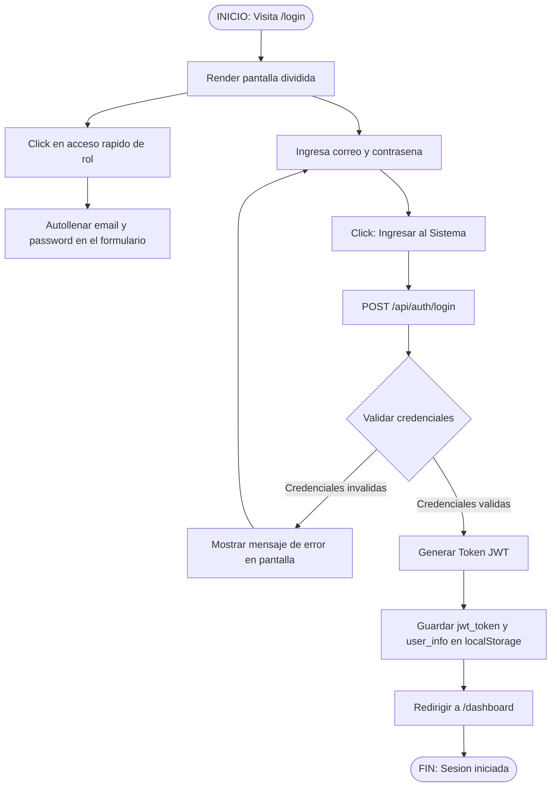
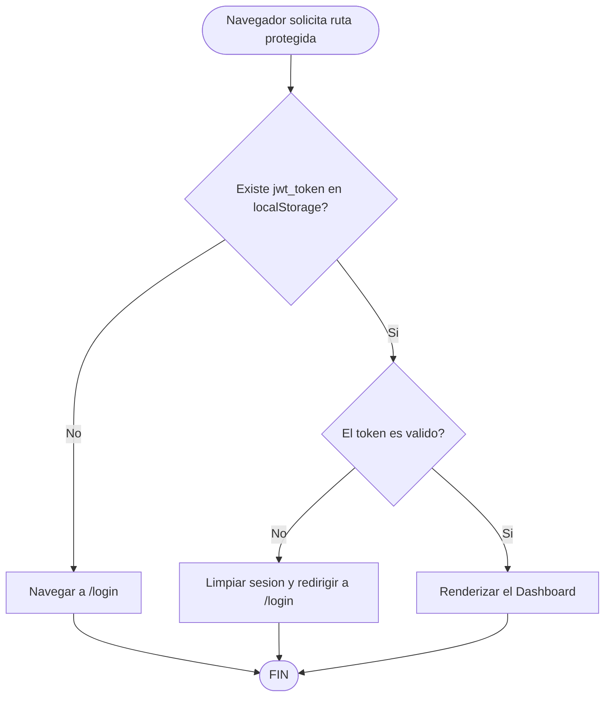
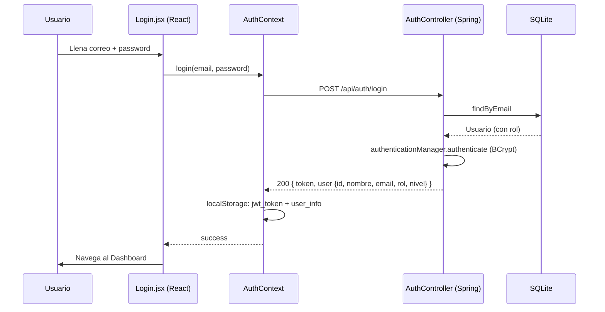

# Flujo de Login

Flujo real del inicio de sesión: pantalla dividida con **credenciales** o **Google OAuth**, accesos rápidos por rol y guard de rutas con JWT.

## 1. Diagrama de Flujo (Login con Credenciales)



## 2. Diagrama de Flujo (Login con Google)

```mermaid
flowchart TD
    A([INICIO: Click en Continuar con Google]) --> B{Origen autorizado?}

    B -->|"Origen (http://localhost:5173) no autorizado"| C["GSI: 403 - The given origin is not allowed"]
    C --> D[Mostrar error: cuenta no disponible]
    D --> E([FIN])

    B -->|Origen autorizado| F[GSI muestra selector de cuenta Google]
    F --> G{Usuario selecciona cuenta}
    G -->|Cancela| H[Mostrar: autenticacion cancelada]
    H --> E

    G -->|Selecciona cuenta| I[Obtener credential (ID Token)]
    I --> J[POST /api/auth/google con credential]
    J --> K{Backend valida ID Token<br/>audiencia + email verificado}
    K -->|Invalido| L[401: No se pudo validar identidad]
    L --> E

    K -->|Valido| M{Email registrado y activo?}
    M -->|No existe o inactivo| N[403: cuenta no registrada]
    N --> E

    M -->|Existe y activo| O[Generar Token JWT propio]
    O --> P[Guardar sesion en localStorage]
    P --> Q[Redirigir a /dashboard]
    Q --> E
```

## 3. Guard de Rutas (Protección del Dashboard)



## 4. Secuencia (Login con credenciales)


