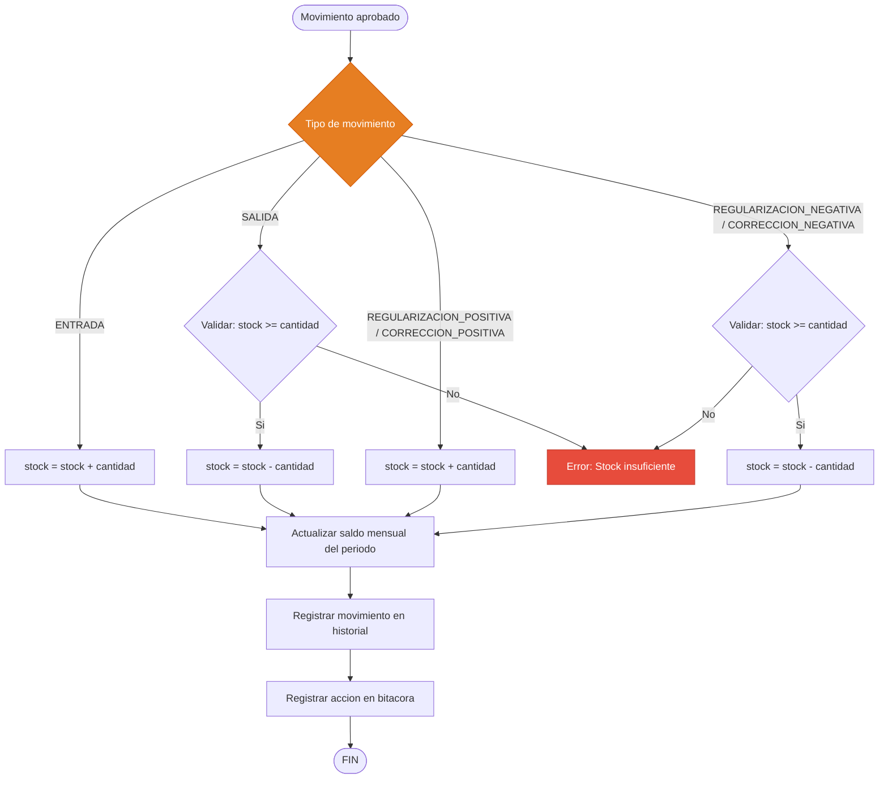
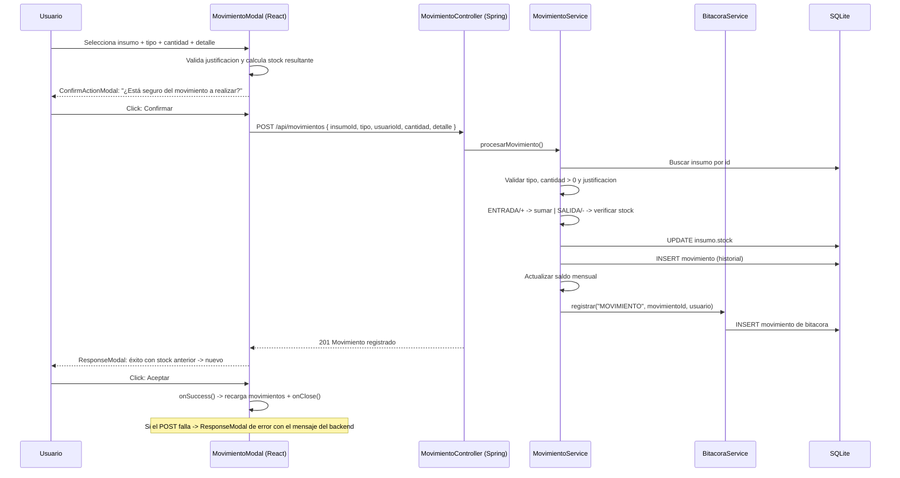

# Flujo de Movimientos de Inventario

Flujo real para registrar movimientos (ENTRADA, SALIDA, REGULARIZACIÓN, CORRECCIÓN): selección de insumo, validación de stock y justificación, **confirmación modal ("¿Está seguro?")** y modal de respuesta con el stock resultante.

## 1. Diagrama de Flujo (General)

```mermaid
flowchart TD
    A([INICIO: Modulo de Movimientos]) --> B[Seleccionar el insumo]
    B --> C[Click: Registrar Movimiento]
    C --> D[Se abre MovimientoModal]

    D --> E[Seleccionar tipo de movimiento]

    E --> E1[ENTRADA]
    E --> E2[SALIDA]
    E --> E3[REGULARIZACION +/-]
    E --> E4[CORRECCION +/-]

    E1 --> F
    E2 --> F
    E3 --> F
    E4 --> F

    F[Ingresar cantidad y detalle/justificacion]

    F --> G{Justificacion cumple minimo?}
    G -->|"ENTRADA/SALIDA: 10 | REGULARIZACION: 20 | CORRECCION: 15"| H[Error: la justificacion debe tener al menos N caracteres]
    H --> F

    G -->|Cumple| I[Calcular stock resultante]
    I --> J[Mostrar modal de confirmacion:<br/>Cantidad | Stock actual | Stock resultante]
    J --> K{Usuario confirma: Esta seguro?}

    K -->|Cancelar| L[Se cierra el modal, no se guarda nada]
    L --> A

    K -->|Confirmar| M[POST /api/movimientos]
    M --> N{Validaciones Backend}

    N -->|Cantidad invalida / insumo no existe / stock insuficiente| O[Mostrar modal de error]
    O --> F

    N -->|Valido| P[Guardar movimiento + actualizar stock + saldo mensual + bitacora]
    P --> Q[Mostrar modal de exito<br/>Stock anterior -> Stock nuevo]
    Q --> R[Click: Aceptar]
    R --> S[Recargar lista de movimientos]
    S --> T([FIN])
```

## 2. Cálculo de Stock por Tipo



## 3. Secuencia



> **Nota:** los tipos REGULARIZACIÓN y CORRECCIÓN solo están disponibles para roles **ADMIN** y **JEFE** (el auxiliar solo registra ENTRADA y SALIDA).
