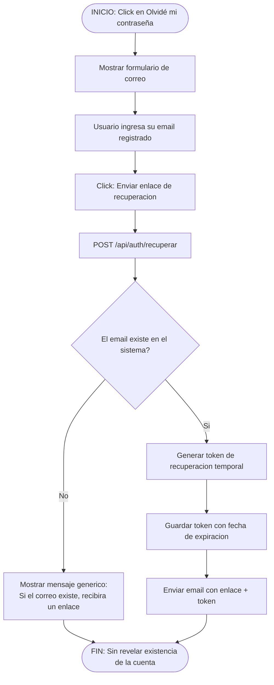
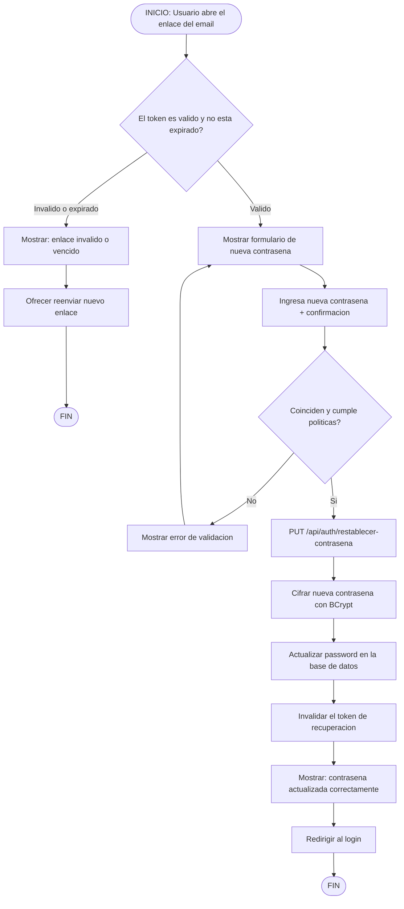
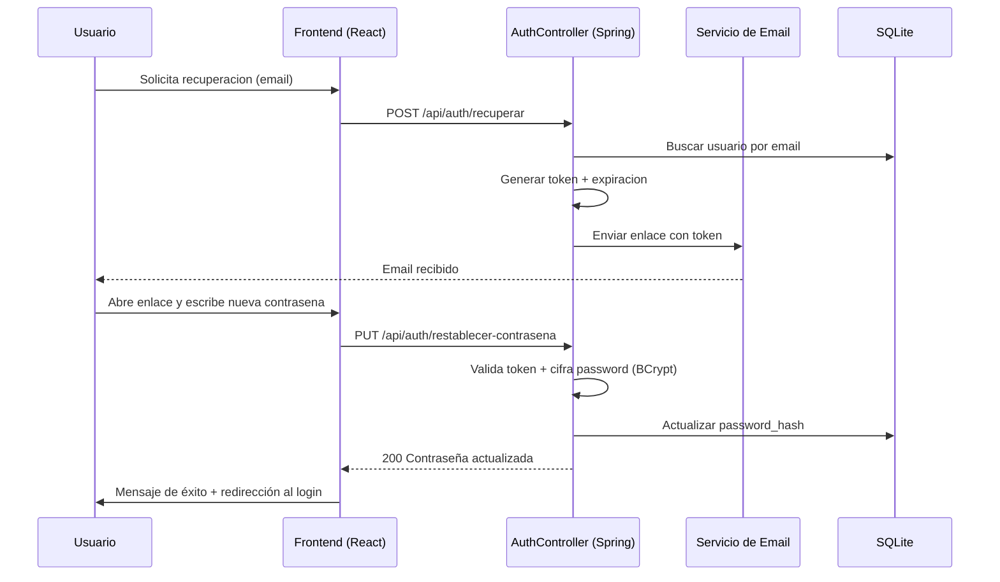

# Flujo de Recuperación de Contraseña

> **Estado: PROPUESTO** — este flujo aún no está implementado en el sistema. Describe el diseño objetivo para la Fase de Mejoras.

## 1. Diagrama de Flujo (Solicitud de Restablecimiento)

## 2. Diagrama de Flujo (Restablecimiento de Contraseña)

## 3. Secuencia (Propuesta)

> **Nota:** requiere agregar una dependencia de envío de correo (ej. Spring Mail) y almacenar el token de recuperación (ej. tabla `password_resets`) en el backend.
